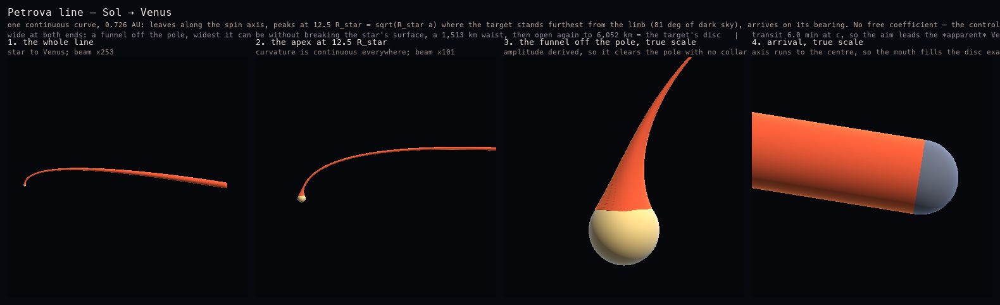
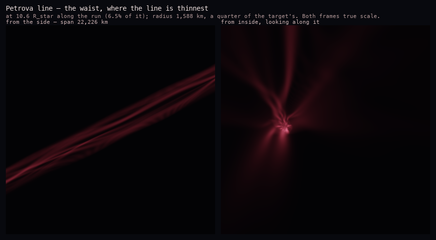
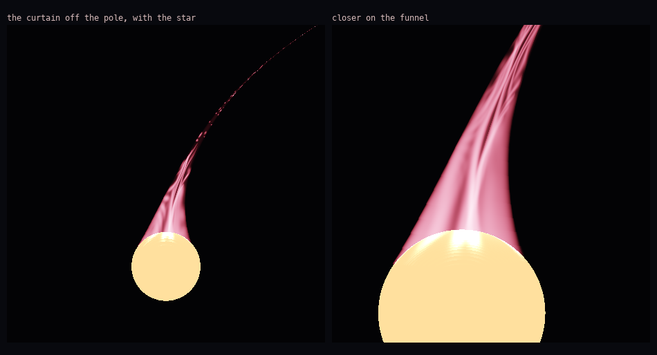

<!-- 페트로바선 기하와 룩 — 별도 시각화 모드가 소비할 도출 결과와 렌더 -->
# 페트로바선 — 기하와 룩

『프로젝트 헤일 메리』의 페트로바선은 NearStars 천체가 아니고, 여기 내용 중 Kerbalism cfg 로 가는
것도 없습니다. 이 문서가 있는 이유는 두 가지입니다. **별도 시각화 모드**가 이 프로젝트의 API 로
이걸 그릴 예정이고, 만드는 과정이 [알펜 날개](planetary-magnetosphere-geometry-methodology.md)용으로
쓴 기계가 자기 기하 밖으로도 일반화되는지 보는 첫 시험대였기 때문입니다. 됩니다 — 스윕 프로파일
필드, 호길이 재샘플링, 렌더러가 그대로 넘어갔고 경로 법칙과 반경 법칙 둘만 갈아끼웠습니다.

아래 값은 전부 `scripts/refs/petrova_line_geometry.py`, 그림은 `scripts/viz/render_petrova_line.py`
산출입니다.

## 형상

[](../../../docs/img/petrova/petrova-geometry.png)

*솔 → 금성. 0.726 AU 짜리 끊김 없는 단일 곡선. 자전축 방향으로 출발해, 목표가 가장 잘 보이는
높이에서 정점을 찍고, 목표 방위로 도착합니다.*

이 선은 **세 토막이 아니라 한 곡선**입니다. 앞선 두 번은 꺾임을 모서리로, 다음엔 접선 아크로
몰아넣었는데 둘 다 틀렸습니다. 조타 근거가 되는 여유각이 가는 내내 좋아지므로 곡률도 전 구간에
퍼져야 합니다.

**꺾임점에는 문턱값이 필요 없습니다.** 극 바로 위에서 보면 목표가 항성 림 *위에* 놓입니다 — 시선이
광구를 스치죠 — 그래서 거기서는 아예 구분이 안 됩니다. 올라가면 림에서 떨어지지만 동시에 목표가
아래쪽 축으로 쏠립니다. 그래서 각 여유

```
gap(H) = arccos(H / √(a² + H²)) − arcsin(R★ / H)
```

가 **비단조**입니다. 최대가 존재하고, 목표가 항성 밖 충분히 멀면 그 최대는 항성 반경과 궤도의
기하평균에 있습니다.

```
H_best = √(R★ · a)
```

솔–금성은 12.5 R☉, 여유 81°입니다. 곡선은 정점이 정확히 거기 오도록 제어점 높이를 역산한 2차
베지어이고, 그 하나로 전부 정해집니다 — 자전축 방향 출발, 가장 잘 보이는 높이에서 정점, 목표
방위로 도착, 전 구간 연속 곡률. 곡선 자체의 자유 계수는 없습니다.

**겨냥은 형상과 별개입니다.** 광속이면 횡단이 6분이고 그동안 경로가 24초각 휘는데, 어떤 배율로
그려도 안 보입니다. 하지만 항법에 쓰는 빛도 그만큼 묵은 것이라, 겨냥점은 *보이는* 목표보다 횡단
변위의 두 배 앞섭니다 — 금성 지름 2.09개, 48초각.

**깔때기**는 극에서 `funnel_tangent_deg` 만큼 떨어진 위도에서 항성에 접합니다. cfg 필드이고 채택값은
60°입니다. 접점에서 값과 기울기가 둘 다 구면과 같아 실루엣이 이음매 없이 흘러 나오고, 위로는 축에
닿지 않고 점근하므로 꼭짓점도 없습니다. 감쇠율은 고르는 값이 아니라 접선 조건이
`cos φ / (R★ sin² φ)` 로 정해 줍니다.

**이걸 구 쓸기로 그리면 안 됩니다.** 반경이 곡선이 나아가는 것보다 빨리 변하면 — 깔때기는 1 R☉
안에서 0.87 → 0.06 R☉ — 앞뒤 구가 서로를 삼켜 표면이 큰 구 몇 개의 겉면이 됩니다. 극 위에 뜬
테두리, 주름 잡힌 칼라, 돔, 뾰족한 꼭짓점. 이 형상에서 쫓아다닌 아티팩트가 전부 이 한 원인이었고,
프로파일을 네 번 손본 건 증상 치료였습니다. `sweep_profile_sdf_np` 는 곡선 위 최근접점을 먼저 찾고
거기서 반경을 읽으므로, 테이퍼가 아무리 급해도 표면이 정확히 `ρ = r(s)` 입니다.

## 허리

[](../../../docs/img/petrova/petrova-waist.png)

*가장 얇은 구간. 주행의 6.5% 지점인 10.6 R☉ 에서 깔때기가 다 좁아져 빔과 만납니다. 반경 1,588 km 로
목표 반경의 1/4입니다. 두 프레임 다 실제 배율입니다.*

단면은 양 끝이 넓고 가운데가 좁습니다 — 항성 위 깔때기, 이 허리, 그리고 목표 원반을 덮으며 다시
벌어지는 아가리. 축은 목표 표면이 아니라 **중심**까지 갑니다. 그래야 아가리가 원반을 정확히 채웁니다.

## 채움

[](../../../docs/img/petrova/petrova-aurora-exterior.png)

*방출 전용 볼류메트릭 마칭. 외부 노출 70, 근접 프레임은 그 1.25배입니다.*

표면으로 그려서는 절대 안 맞습니다. 참조는 얇은 데로 별이 비치는 겹겹의 반투명 드레이프라, 채움은
매질을 통과하는 **방출 적분**입니다 — 표면도 조명도 없습니다. 그래서 얇은 곳이 반투명하게 남고,
시트를 모서리로 보면 저절로 밝아집니다. 팔레트는 참조 프레임에서 뽑았습니다(`#a01b28` ~ `#dd4a5f`).

매질은 채워진 관이 아니라 **접힌 시트의 합**이고, 그게 드레이프로 읽히는 이유입니다. 인공적으로
보이지 않기까지 세 가지가 필요했습니다.

- **시트마다 해시로 흩기.** 등간격에 위상이 인덱스에 선형이면 빗살로 읽힙니다 — 눈이 주기를 즉시
  찾습니다. 방위각·반경·접힘 주파수·폭·밝기를 전부 시트별로 흩고, 접힘 주파수는 서로 무리비로 두어
  드레이프가 다시 맞아떨어지지 않게 했습니다.
- **시트를 서로 다른 반경에** 놓아, 한 껍질에 몰리지 않고 깊이 방향으로 층이 지게.
- **접힘 파장을 국소 관 반경으로** 재기. 절대 호길이로 재면 안 됩니다. 이 관은 폭이 네 자릿수로
  변해서, 호길이에 걸린 건 가는 구간에서 반경 수천 개에 걸쳐 균일해집니다.

밝기는 클램프가 아니라 채널별 Reinhard 입니다. 어느 지점에서 자르면 그 위가 전부 같은 색 판이 되고,
반대로 피크를 없애면 하이라이트가 밋밋해집니다. 채널별로 굴리면 피크가 존재하면서 면적은 거의 없게
됩니다 — 빨강이 먼저 포화하고 초록·파랑은 한 자릿수 뒤에 따라오니까요. 넓은 흰 영역이야말로
클리핑된 SDR 로 읽히는 것이고요.

그 피크가 설 자리를 만드는 건 노출이 아니라 다이내믹 레인지입니다. 시트가 얇으면 수직으로 지나는
광선은 적게 쌓이고 모서리로 스치는 광선은 그대로 쌓이니, 화면 전체가 밝아지는 대신 필라멘트와 배경의
비가 벌어집니다.

전부 해석적입니다 — 사인 몇 개와 sine-hash, 텍스처 없음. KSP 에서 레이마칭 볼륨이 실제로 돌아가고
(EVE Volumetrics) 같은 식이 셰이더로 그대로 넘어가야 하기 때문입니다. `sheet_ribbons()` 는 같은
식에서 나오는 가산 메시 경로로, 어쩔 수 없는 대안이 아니라 선택지입니다.

## Related

- [`planetary-magnetosphere-geometry-methodology.md`](planetary-magnetosphere-geometry-methodology.md)
  — 여기서 기계를 빌려온 알펜 날개 형상 계열.
- [`tools.md`](tools.md) §14 — 계산기와 렌더러.
- [`plugins/NearStarsFluxTube`](../../../plugins/NearStarsFluxTube/README.md) — 이걸 소비할 별도
  시각화 모드.
