<!-- 자기권 레시피의 증거·도출 기록. Part 1 = 태양계 7천체 스톡 대 물리 감사, Part 2 = 도출 과정과 기각된 접근 -->
# 자기권 증거·도출 기록

**포획 입자 벨트를 가진 자기권**(또는 그저 자기권을 가진) 태양계 천체를 하나씩 훑으며,
**Kerbalism / ROKerbalism 스톡 cfg**를 **ADS로 근거화한 실제 물리**와 대조하는 감사입니다.
NearStars의 자기권 지오메트리 레시피가 가상 천체용 벨트를 뽑아내기 전에 실제 바디로 먼저
보정하고, 스톡 모델이 러프한 자리채움에 그친 곳에는 물리 정확 cfg 값을 되먹이려고 존재합니다.

아래 각 바디가 **단면 두 장**을 함께 싣습니다. 두 렌더 모두 인게임 `RadiationModel` SDF입니다. **스톡**은 출하 cfg(2026-07-24에
`KSP-RO/ROKerbalism`의 `System/Radiation.cfg` + `Support/RSS.cfg`로 검증), **물리**는 같은 SDF에서
여섯 개 벨트 모양 파라미터를 ADS로 앵커한 자기력선 사이의 실제 쌍극 drift-shell 영역
(r = L cos²λ, 대기 상단에서 loss-cone 컷)에 **수치적으로 적합**한 것입니다
(`scripts/viz/fit_belts.py`, Nelder-Mead 다중 시작). 적합 품질은 벨트별 IoU(단면 면적 겹침)로
명시합니다. **어디서나 ≥ 0.96**이고 목성의 납작한 magnetodisc만 예외입니다(0.87, 토러스 모델의
천장). 적합된 파라미터 세트는 렌더 드라이버에 들어 있습니다. 2-셸 토러스로는 실제 특징 일부
(위성/고리 간극, 시간 변동)를 여전히 못 담습니다(아래 명시). 렌더러는
`scripts/viz/render_belts.py`(+ `render_belts_bodies.py` 드라이버), SDF는
[`src/Kerbalism/Radiation/Radiation.cs`](https://github.com/Kerbalism/Kerbalism/blob/master/src/Kerbalism/Radiation/Radiation.cs)
재현(출처 [Kerbalism](https://github.com/Kerbalism/Kerbalism), [Unlicense](https://github.com/Kerbalism/Kerbalism/blob/master/LICENSE)·퍼블릭 도메인). 場 모양 스키마는
[`planetary-magnetosphere-geometry-methodology.md`](planetary-magnetosphere-geometry-methodology.md)
를 보세요.

**렌더 읽는 법.** 색 = 선량(inferno), 청록 = cfg의 자기권계면, 주황 파선 = 같은 standoff의
**Shue 자기권계면**(위성 관측을 피팅한 경험 형상. 비교용이고 점이 `r0`), 회색 = 바디,
원 = 바디 반경 눈금, 항성은 +x 방향입니다. 벨트는 기울어진 자기 프레임, 자기권계면은 항성정렬
프레임에서 그립니다. Kerbalism 자신이 그렇게 계산합니다. 계면은 `Gsm_space(rb, false)`로
렌더·선량 계산하고, 기울어진 프레임은 벨트 몫입니다. 2026-08-13부터 벨트 *내부*를 결정하는 두
필드(선량 램프 `radiation_*_gradient`, 벨트 `*_compression`/`*_extension`)는 스톡 복사가 아니라
도출값입니다. 레시피와 그것이 뒤집은 것들은 방법론 문서 Part C에 있습니다. 목성과 토성은
standoff가 63·24 바디 반경이라 계면을 프레임에 담으면 벨트가 알아볼 수 없이 작아지므로, 이 둘은
벨트에 맞춰 두었습니다.

**자기권계면 벌어짐은 2026-08-14 기준으로 근거화되었습니다.** 이제 자기화된 바디의 물리 프리셋은
모두 `pause_compression`을 **전문으로 검증한** Shue 벌어짐 파라미터의 `2^α`로 두어,
`log₂(compression)`이 α를 정확히 되돌려주고 `pause_radius`가 노즈 × `2^α`가 됩니다. 수성 0.500
(Winslow 2013), 지구 0.580(Shue 1998 식 11), 목성 0.423(Rutala 2025 S97*), 토성 0.736(Kanani 2010.
같은 노즈에서 Arridge 2006과 0.0002까지 교차검증). 천왕성과 해왕성은 발표된 피팅이 없어 지구의
0.580을 **유추로** 가져왔고, Voyager 2가 이 둘을 관측된 자기권 중 가장 텅 빈 것으로 확인했다는 점이
근거입니다 — Io급이나 Enceladus급 플라스마 공급원이 없으니 적재 수준이 거대행성보다 지구에
가깝습니다. 이전에 외행성 넷에 일괄로 쓰던 `compression` 1.2는 임시값이었고, 측면을 25–39% 낮게
잡고 있었습니다. 도출 과정과 인용, 그리고 외삽할 α(압력) 법칙이 없는 이유는 방법론 문서 Part A에
있습니다. `pause_extension`은 각 바디의 기존 꼬리 길이를 유지하기 위해서만 다시 계산했으며, 그 꼬리
길이는 여전히 근거 없는 임시값입니다. 꼬리 길이는 별개의 문제로 미뤄 두었습니다.

# Part 1 — 천체별 증거

## Scope — 자기화된 바디만

벨트가 생기려면 입자를 가둘 만큼 강한 고유 다이나모가 필요합니다. 태양계에서는 **7개 바디**
입니다. 지구, 목성, 토성, 천왕성, 해왕성(행성 다이나모), 수성(아주 작음), 그리고 가니메데
(임베디드 위성 다이나모)입니다. **금성, 화성, 달, Io, Europa, Callisto, Titan, Triton, 명왕성**
은 고유 전역장이 없어 벨트가 없고, 방사선은 직접 풍/GCR 플럭스입니다. 벨트 감사의 범위 밖입니다.

**다만 cfg가 없는 것은 아닙니다**(2026-08-14 정정). Kerbalism은 이들 중 여럿에 *pause만 있는*
`RadiationModel`을 줍니다. 벨트 필드 없이 경계만 있는 형태이고, "이 바디엔 아무것도 없다"고
넘기기 전에 알아둘 값입니다.

| 모델 | 형상 | 쓰는 바디 | 읽는 법 |
|---|---|---|---|
| `ionosphere` | pause 1.1 R, extension 0.2, 벨트 없음 | **금성**(`radiation_pause` −0.005), 타이탄(RSS.cfg) | 유도 자기권. 다이나모가 없어 항성풍이 상층 대기를 이온화해 얇은 전도층을 만든다 |
| `irregular` | pause 1.25 R, compression 1.1, extension 0.75, **`pause_deform` 0.1** | **화성**(업스트림 `Duna`, `radiation_pause` −0.003) | 지각 잔류 자기. deform 항이 쌍극이 아니라 울퉁불퉁한 얼룩 약장으로 보이게 만드는 원인이다 |
| `anomaly` | pause 0.5 R, extension 0.8, height 0.45, `pause_deform` 0.05 | Io | 자기권이라기보다 표면 이하 규모의 패치 |
| `solidiron` / `metallic` | 작은 pause 껍질 | Bop, 스톡 미할당 | 조밀한 무대기 바디용 자리채움 |
| `surface` | pause 1.075 R | (표면 선량 껍질로 전용) | 자기장이 아님 |

### 금성 — 유도 갈래를 계산한 결과

| 스톡 | 물리 |
|---|---|
| 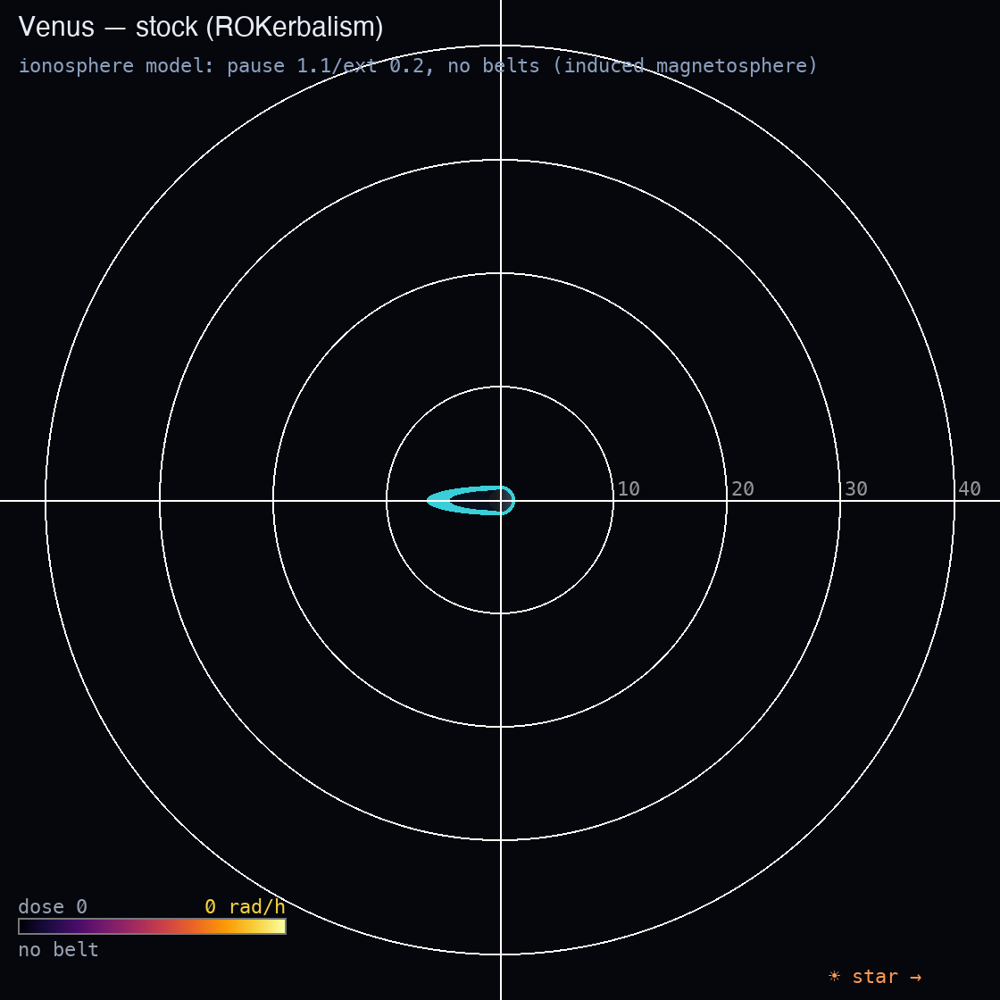 | 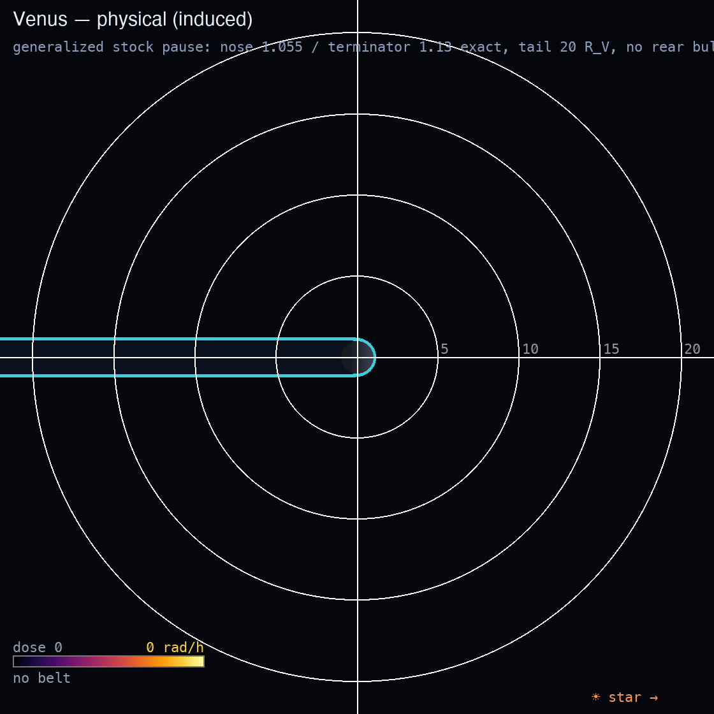 |

물리 프리셋은 쌍극자 레시피가 아니라 유도 자기권 레시피로 계산했습니다. 금성의 평균 이오노포즈는
직하점 위 330 km, 황혼 명암경계선 700 km, 새벽 1000 km이고(Brace 1980,
[`1980JGR....85.7663B`](https://ui.adsabs.harvard.edu/abs/1980JGR....85.7663B)), `R_V` 6051.8 km 기준으로 **노즈 1.055 R_V, 명암경계선 평균
1.140 R_V**입니다. cfg 의미론으로 옮기면 `pause_radius` **1.14**, `compression` **1.0123576**,
`extension` **0.0072072**이고, 여기에 일반화 필드 둘 `pause_smooth` **0.57**과 `pause_waist` **0**이
붙습니다(둘 다 스톡 Kerbalism에는 없는 필드입니다. 아래를 보세요). 여기서 주의할 것이 있습니다.
스톡 항등식 `노즈 = pause_radius/compression`과 `꼬리 = pause_radius/extension`은 **`pause_smooth`가
0일 때만** 성립합니다. 스무딩을 켜면 노즈는 축 위에서 `|px| = pause_radius`의 근이고(Part C의 닫힌
형식), 위 두 값도 그쪽으로 풀었습니다. 노즈 1.0545는
정확히 떨어지고, 꼬리는 프로젝트 공통 `L` = 150 × 노즈 규약에 따라 158 R_V에서 닫힙니다. 유도 자기권
경계의 가장 먼 확인 통과 지점인 20 R_V보다 넉넉히 바깥입니다(Edberg 2024,
[`2024JGRA..12932603E`](https://ui.adsabs.harvard.edu/abs/2024JGRA..12932603E), [2410.21856](https://arxiv.org/abs/2410.21856)).
벨트는 없고 `radiation_pause`는 배포값 −0.005를 유지합니다. 유도 경계는 쌍극 자기권계면보다 GCR을
훨씬 덜 가리기 때문입니다.

명암경계선은 정확히 떨어지지 **않고**, 그 이유는 적어둘 만합니다. `pause_radius`는 모든 지점의 폭
상한이라, 이것을 실측 명암경계선 평균으로 두면 경계가 측정치를 넘는 일이 없습니다. 그런데 그 최대
단면을 실제로 담는 평면은 `−½(compression−extension)·pause_smooth/√(compression·extension)`에
놓이고, 이 꼬리 길이에서는 하류 3.35 R_V입니다. 그래서 `x` = 0 단면은 1.1034로, Brace의 1.1405보다
3.3% 좁습니다. `pause_waist`로 최대폭 평면을 명암경계선까지 끌어오는 길은 여기서는 막혀 있습니다.
이 꼬리 길이에서 필요한 이동량이면 노즈가 무너집니다.

스톡과 비교하면 도출한 주간면이 행성에 더 바짝 붙고(1.05 대 균일 1.1 R), 꼬리는 훨씬 깁니다
(158 대 5.5 R_V).

**형상은 스톡 함수를 일반화한 것이고, 기본이 아니라 대체 수단입니다.** 프로젝트 정책은 피팅된 α가
있는 곳은 Shue를 쓰고(지구, 수성, 목성), Shue가 기하적으로 그 경계를 표현할 수 없는 곳에서만 일반화한
스톡 함수로 물러나는 것입니다. 금성과 화성이 그 예외입니다. 이 경계에 대한 문헌 자신의 모델은
주간면 원에 5.77° 야간면 원뿔을 이어 붙인 형태이고(Martinecz 2009,
[`2009JGRA..114.0B30M`](https://ui.adsabs.harvard.edu/abs/2009JGRA..114.0B30M), Edberg 2024가 20 R_V까지 손대지 않고 유효함을 확인),
그것을 재현하려면 게임이 형상 계열을 하나 더 들고 가야 합니다. 그래서 대신 배포되는 함수를 제자리에서
고치는 필드 둘을 씁니다. `pause_smooth`는 두 반구가 만나는 자리의 기울기 꺾임을 없애고,
`pause_waist`는 가장 넓은 단면을 행성 중심에서 풀어 줍니다. 둘 다 기본값이 0이라 스톡 거동은
비트 단위로 그대로입니다. 모든 스톡 프리셋이 동일한 PNG로 다시 렌더됩니다. 배포된 Kerbalism은 아직
어느 쪽도 읽지 않으므로 Harmony 패치를 기다리고, emitter는 이 둘을 cfg에 쓰지 않습니다.

구속 조건은 **경계가 명암경계선 뒤에서 불룩해지지 않아야 한다**는 것이었습니다. 폭이
`√(radius² − px²)`이므로 `radius`를 넘을 수 없고, 따라서 `radius`를 실측 명암경계선 폭으로 두면
후방 불룩함이 구조적으로 불가능해집니다. 대가는 후류 폭입니다. 실측 원뿔과 비교해 2 R_V에서 15%,
5에서 33%, 10에서 54% 좁습니다. 그 지점에서는 어떤 Shue 파라미터화도 훨씬 나쁘고(−83% ~ −100%),
행성 표면 아래로 파고든 원뿔곡선까지 포함해 여섯 형상을 측정한 전체 후보 표는 방법론 문서 Part A에
있습니다.

### 화성 — MPB 주간면을 계산한 결과

| 스톡 | 물리 |
|---|---|
| 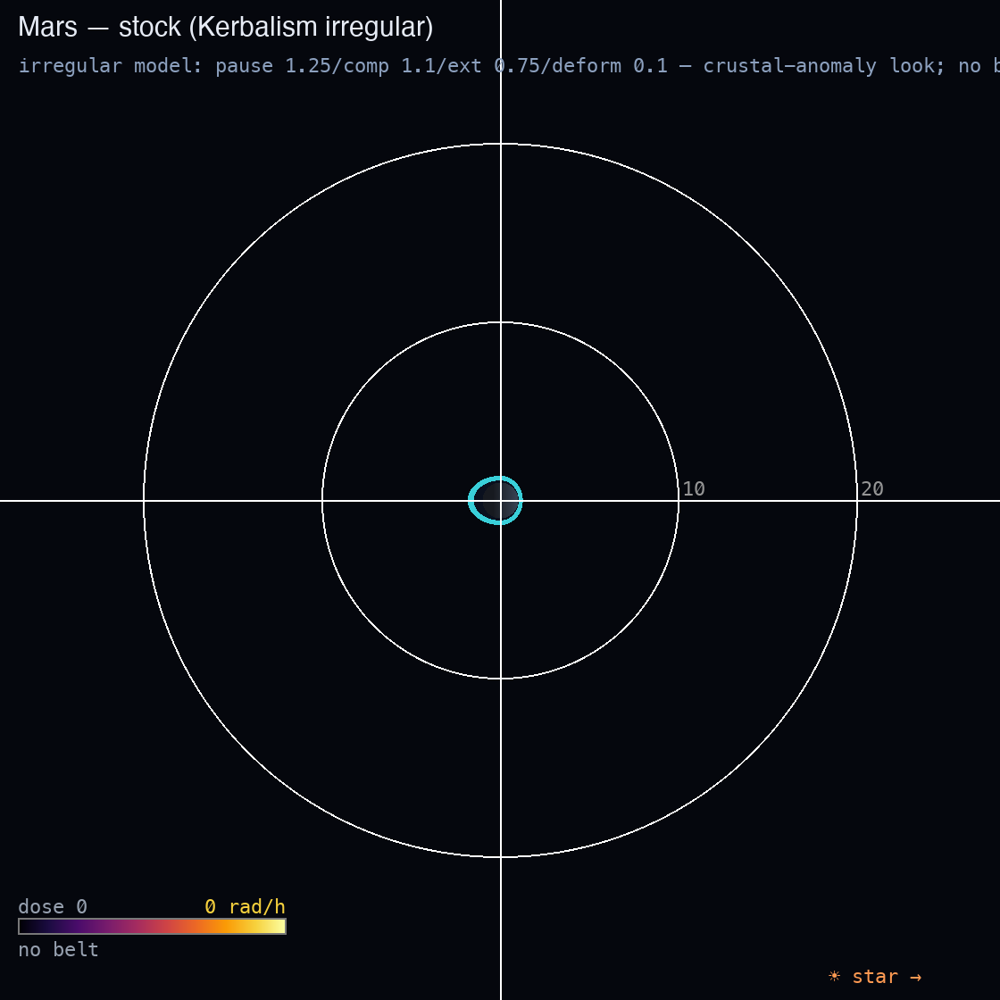 | 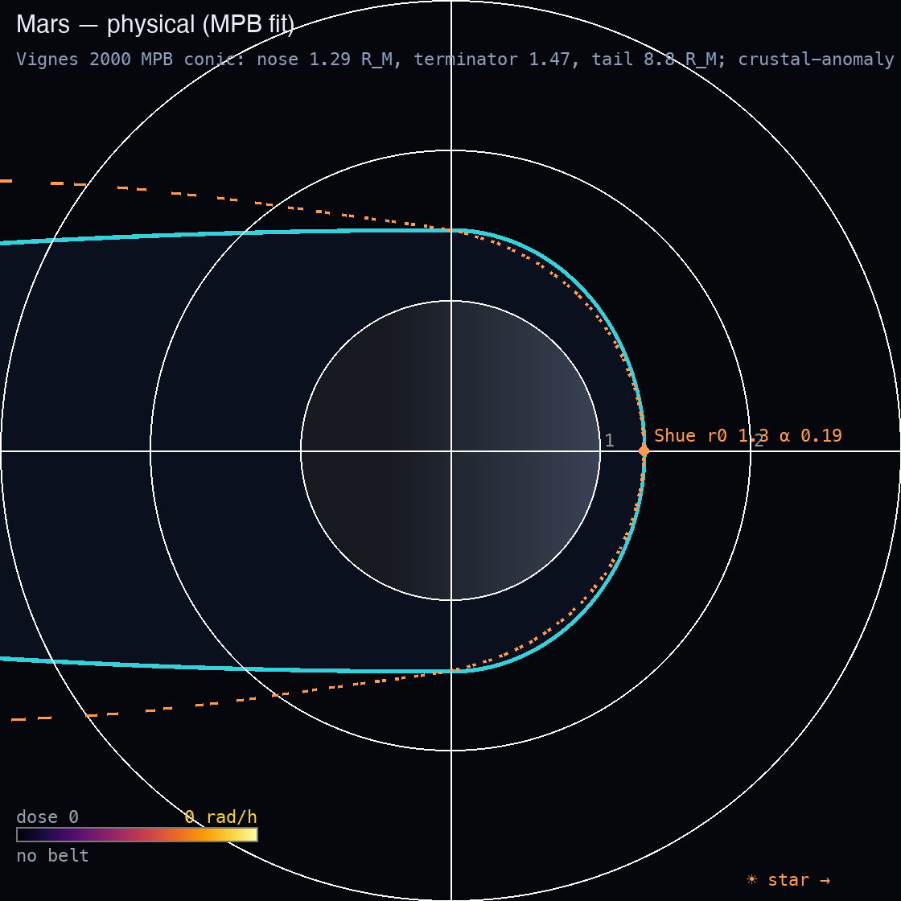 |

화성의 경계는 **자기 파일업 경계(MPB)**이고, Vignes 2000([`2000GeoRL..27...49V`](https://ui.adsabs.harvard.edu/abs/2000GeoRL..27...49V),
Table 2, MGS 488회 통과 직접 적합)이 원뿔을 그대로 줍니다. `X₀` 0.78 ± 0.01, 이심률 0.90 ± 0.01,
반통경 `L` 0.96 ± 0.01, **직하 `R_SD` 1.29 ± 0.04 R_M**, **명암경계선 `R_TD` 1.47 ± 0.08 R_M**
입니다. 옮기면 이렇습니다.

- `pause_radius` = 플랭크 = **1.47**, `compression` = 1.47/1.29 = **1.1395**(노즈 1.29 복원)
- 주간면 오버레이는 그 두 점을 지나는 원이다. **반지름 1.4833, 중심 x −0.1983**
- 야간면은 그들의 원뿔에서 **가져오지 않는다**. Vignes 자신의 초록이 "야간면 MPB 위치는… 변동이
  매우 크다"고 적고, Němec 2020([`2020JGRA..12528509N`](https://ui.adsabs.harvard.edu/abs/2020JGRA..12528509N))은 MAVEN 기반 모델조차
  "명암경계선 너머에서는 신뢰할 수 없다고 본다"고 한다. 그 공백까지 연장하면 그들의 타원은
  x ≈ −3.8에서 2.20 R_M(명암경계선 폭의 1.5배)까지 불룩해지고 −8.8에서 닫히는데, 둘 다 통과 자료가
  없는 영역이다

대신 야간면은 금성의 실측 벌어짐을 명암경계선 반지름으로 스케일해 **7.49°**를 씁니다. 두 행성의 유도
자기꼬리 구조에 유의한 차이가 없다는 Phobos-2 / Pioneer Venus
비교([`2001AGUSM..SM32D06K`](https://ui.adsabs.harvard.edu/abs/2001AGUSM..SM32D06K))가 근거입니다. 이는 **유추이고 화성 측정치가
아니며**, 렌더에도 그렇게 라벨해 둡니다. 통과하도록 설계하지 않았는데 통과한 검증 하나가 있습니다.
그 각도에서 주간면 원은 명암경계선에 기울기 0.135로 만나고 원뿔 쪽은 0.131이라, 3% 안에서 매끄럽게
이어집니다. 다만 이 검증은 배포하지 않는 원 + 원뿔 형식에 속한 것입니다. 실제로 배포하는 값은
`pause_radius` **1.47**, `compression` **1.0601082**, `extension` **0.0075969**에 `pause_smooth` **0.735**이고,
Vignes의 노즈 1.29를 정확히 복원하면서 같은 `L` = 150 × 노즈 규약에 따라 꼬리는 194 R_M에 놓입니다.
금성과 같은 이유로 `x` = 0 단면은 상한 1.47이 아니라 1.4182로 3.5% 좁습니다.

`pause_deform`은 스톡 `irregular`의 0.1을 그대로 둡니다. 지각 잔류자기가 실제로 비축대칭인 것은
맞지만 Vignes가 그 비대칭을 정량화하지 않으므로, 진폭은 도출이 아니라 상속입니다. 지어내지 않고
표시만 해 둡니다. 스톡과 비교하면 도출 경계가 더 멀리 서고(노즈 1.29 대 1.25, 플랭크는 1.47 대
둥근 형태) 꼬리가 훨씬 깁니다(194 대 1.7 R_M).

금성과 화성 모두 벨트는 없습니다. 다이나모가 없으니 포획도 없습니다.

**짚어둘 배포 갭.** ROKerbalism의 `Support/RSS.cfg`는
`+RadiationBody[Duna] { @name = Mars }`로 이름을 바꿔 복사하는데, 업스트림 KerbalismConfig를
통째로 대체하는 그들 자신의 `System/Radiation.cfg`에는 `Duna` 정의가 없습니다
(2026-08-14 `KSP-RO/ROKerbalism@master`로 확인). 복사의 원본이 없으니 **ROKerbalism 조합에서는
화성에 `RadiationBody`가 아예 생기지 않습니다.** 업스트림 Kerbalism은 화성에 `irregular` 모델을
줍니다. 인게임에서 화성의 울퉁불퉁한 약장 경계를 본 기억이 있다면 RSS 조합이 아니라 업스트림
설정으로 돌린 경우입니다.

## cfg를 올바로 읽기 (함정 둘)

이 감사의 이전 개정본(그리고 손으로 배치한 "물리" 렌더)은 SDF 파라미터 둘을 오독했습니다.
둘 다 전체에 걸쳐 바로잡았고 기록해 둘 값이 있습니다.

1. **벨트의 `dist`/`radius`는 `deform_xy`로 눌린 좌표계에 있습니다.** SDF는
   `√((x²+z²)·deform_xy) − dist`를 검사하므로 벨트의 *적도* 범위는
   `(dist ± radius)/√deform_xy`이고, 여기에 border 토러스가 더 도려냅니다. 스톡 지구의 외대
   (2.6338/2.48, deform_xy 0.7225, border 1.4412/1.4875)는 실제로 **적도에서 3.45–6.0 R_E**에
   걸칩니다 — `outer_dist`를 순진하게 읽어 짐작하는 "2.6 R_E 중심"이 아니라, 물리적 외대 heart
   (L 3–7)에 가깝습니다.
2. **`pause_radius`는 sub-solar standoff가 아닙니다.** 주간측 x는 구 검사 전에
   `pause_compression`이 곱해지므로 코 = `pause_radius/pause_compression`, 옆구리 = `pause_radius`,
   꼬리 = `pause_radius/pause_extension`입니다. 스톡 지구(15, comp 1.5) → 코가 정확히
   **10 R_E** = Shue standoff이고, 옆구리/코 = 1.5 = 2^0.585(Shue α)입니다. 따라서
   Chapman–Ferraro standoff를 NearStars가 emit하려면 반드시 `pause_radius = R_mp × pause_compression`
   으로 설정해야 합니다.

## Summary table — 물리 앵커 (전부 ADS 핀)

| Body | Magnetopause standoff | Dipole tilt | Offset | Belt structure | Peak dose (order) |
|---|---|---|---|---|---|
| **Earth** | ~10 R_E | 11° | small | two separated belts (D inner + hollow outer) | ~10² rad/day (peak) |
| **Jupiter** | **63 R_J** (compressed) / 92 (expanded) | 10.3° | ~0.13 R_J | dipolar inner (D-cut) + flat magnetodisc | ~10³–10⁴ rad/day |
| **Saturn** | **22–27 R_S** | **<0.007°** | 0.047 R_S N | **no classic inner belt** (rings sweep it); weak moon-chopped outer; CRAND-only | ≪ Jupiter |
| **Uranus** | **18 R_U** | **59°** | **0.3 R_U** | offset+tilted, moon-swept, helical tail | e⁻ ≥1.2 MeV |
| **Neptune** | **26.5 R_N** | **47°** | **0.55 R_N** | offset+tilted, peak L≈7, Triton cut ~14 R_N | e⁻ >1 MeV |
| **Mercury** | **1.45 R_M** (1.35–1.55) | <3° | 0.20 R_M N (484 km) | **no stable belt** — surface is the loss cone | (surface direct) |
| **Ganymede** | **~2 R_G** (upstream) | ~176° (≈anti-aligned) | — | weak embedded, **open polar caps**, source-starved | shield −50–60% of ambient |

핵심 발견. **(1)** 스톡 ROKerbalism의 **지구는 cfg를 올바로 읽으면 성격과 위치 둘 다 잘
보정되어 있습니다**(D컷 내대 1.3–2.0 R_E, 속 빈 외대 3.45–6.0, 자기권계면 코 10 R_E) — 이전
개정본은 위의 cfg 함정 둘 때문에 위치 어긋남을 주장했으나 철회합니다. **(2)** 진짜 스톡 오류는
**목성**(벨트가 ~3배 너무 바깥, D-cut 없음, magnetodisc 없음)과, 범용 `saturn` 모델의 튜닝
안 된 사본을 공유하는 **빙거성들**입니다(0–14 R에 걸치는 outer 7/7 덩어리, pause 20 — 바디별로
다른 건 tilt/offset뿐이고, 천왕성 `radiation_inner = 75`와 해왕성 `= 39`는 죽은 cfg입니다.
모델이 `has_inner = false`이기 때문입니다). **(3)** **토성의 "외대만, 내대 없음"** 스톡 선택은
*물리적으로 옳습니다* — 고리가 내대 자리를 차지하고 흡수해 버립니다 — 다만 그 7/7 덩어리는
여전히 쓸려나간 고리 영역을 넘쳐 채웁니다. **(4)** **벨트 강도의 출처**는 어디서나 도출값이
아니라 튜닝값입니다.

---

## 바디별: 스톡 cfg vs 물리

각 블록은 스톡 `RadiationBody`/`RadiationModel`(ROKerbalism `System/Radiation.cfg` + RSS
앵커), ADS 핀이 붙은 물리값, 그리고 그 차이(delta)를 제시합니다.

### Earth (캘리브레이션 앵커 — 그리고, 올바로 읽으면 좋은 앵커)

| 스톡 | 물리 |
|---|---|
| 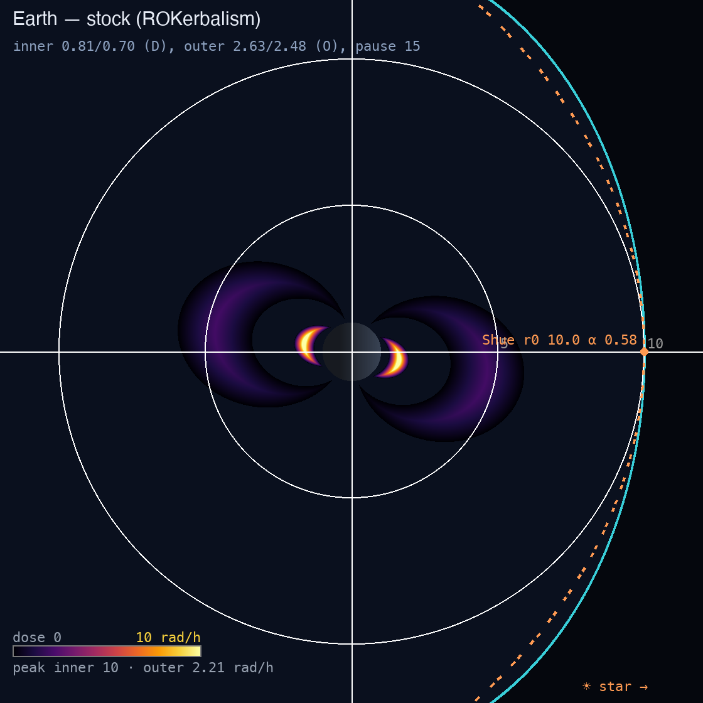 | 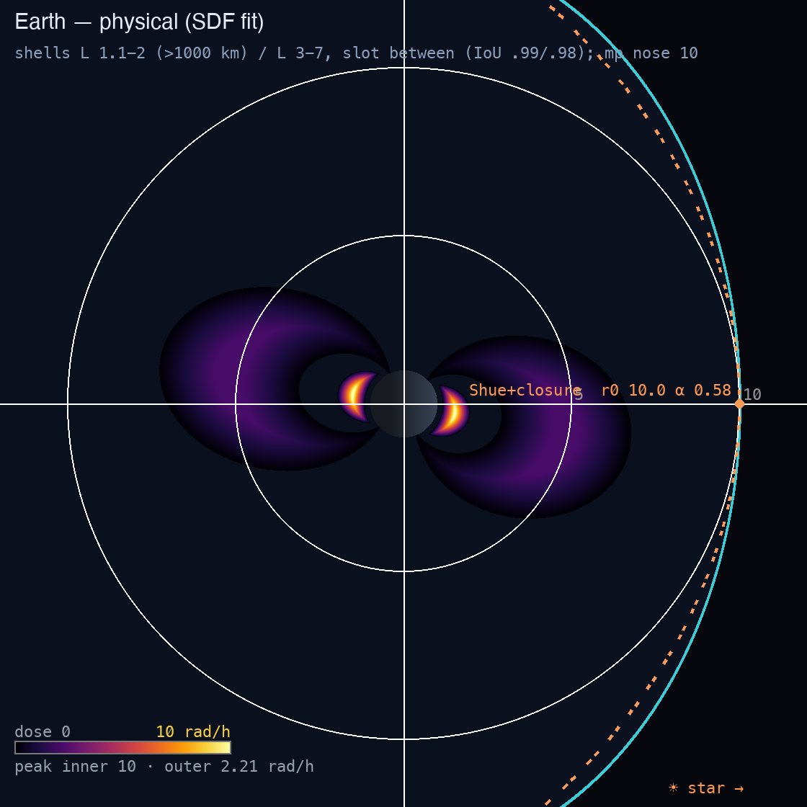 |

| Field | Stock (`earth`) | Physical | Source |
|---|---|---|---|
| pause | 15 / comp 1.5 → **코 10 R_E** | ~10 R_E sub-solar ✓ | Shue 1997 [`1997JGR...102.9497S`](https://ui.adsabs.harvard.edu/abs/1997JGR...102.9497S), Fairfield 1971 [`1971JGR....76.6700F`](https://ui.adsabs.harvard.edu/abs/1971JGR....76.6700F) |
| inner belt | 0.813/0.70 dxy 0.572, border 0.915 → 적도 **1.29–2.0 R_E** | 피크 **L≈1.5**, ~1.1–2 R_E, 하한 ~1000 km(그 아래는 loss-cone 고갈. SAA에선 dipole offset 때문에 ~200 km까지 내려옴) ✓ | (AP9; Ripoll 2016) |
| outer belt | 2.63/2.48 dxy 0.7225, border 도려냄 → 적도 **3.45–6.0 R_E** | **heart L≈4–5**, L 3–7 (≈; 가장자리 6 vs 7) | Reeves 2013 [`2013Sci...341..991R`](https://ui.adsabs.harvard.edu/abs/2013Sci...341..991R), Thorne 2013 [`2013Natur.504..411T`](https://ui.adsabs.harvard.edu/abs/2013Natur.504..411T) |
| slot region | 2.0–3.45 R_E 간극 ✓ | **L≈2–3** (hiss가 비움) | Ripoll 2016 [`2016GeoRL..43.5616R`](https://ui.adsabs.harvard.edu/abs/2016GeoRL..43.5616R) |
| radiation_inner/outer | 10.376 / 2.214 | 자릿수 일치 | — |
| geomagnetic_pole_lat / offset | 80.37 (tilt 9.6°) / 0.07 | tilt ~11° / ~0.08 R_E | IGRF (정확) |

올바른 SDF 의미로 읽으면 스톡 앵커는 **성격과 위치 둘 다 좋습니다**. D컷 내대 1.29–2.0 R_E,
슬롯, 속 빈 외대 3.45–6.0, 자기권계면 코가 정확히 10 R_E, 정확한 tilt/offset, 관측 양성자
피크와 맞는 내대 선량 ~10.4 rad/h. (이 문서의 이전 개정본은 pause가 1.5배 넉넉하고 외대가
2배 안쪽이라 주장했으나 — 둘 다 위의 cfg 읽기 함정이었고 철회합니다.) 물리 렌더는 정확한
L-shell을 재적합합니다(내대 L 1.1–2에 하한 ~1000 km, 외대 L 3–7. IoU 0.99/0.98). 스톡 대비 눈에 보이는
차이는 작습니다 — 외대 가장자리 7 vs 6 R_E, 그리고 살짝 더 두꺼운 내대 초승달입니다. 외대 혼(horn)의 저고도 컷(~300 km)은 그대로 둡니다 — 내대와 달리 외대 전자는 bounce/drift loss cone을 타고 저고도로 일상적으로 강수합니다(POES 관측. Liu 2024 [`2024JGRA..12932171L`](https://ui.adsabs.harvard.edu/abs/2024JGRA..12932171L)).

### Jupiter

| 스톡 | 물리 |
|---|---|
| 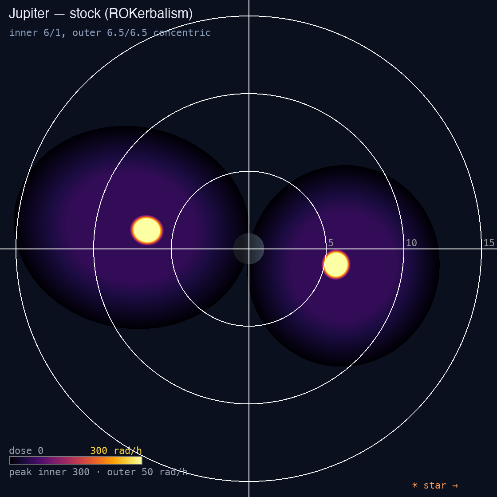 | 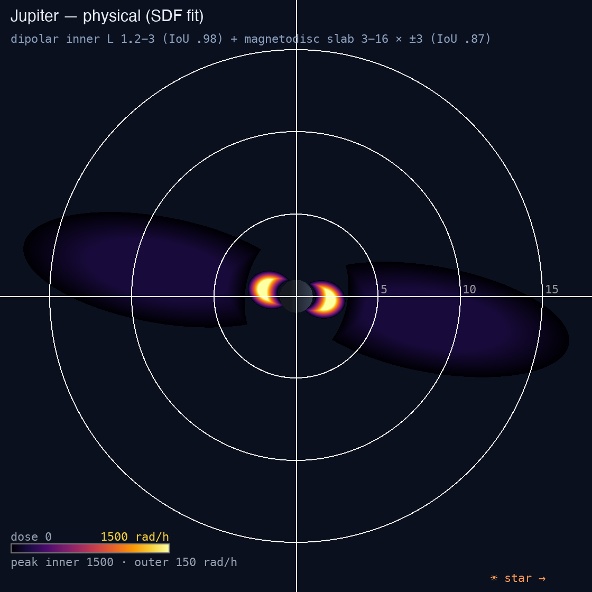 |

| Field | Stock (RSS `jupiter`) | Physical | Source |
|---|---|---|---|
| inner belt | 6.0/1.0 (dxy 없음) → 적도 **5–7 R_J** | 쌍극형 셸 **L 1.2–3** (피크 ~1.5–2 R_J; 적합 IoU .98) | Divine & Garrett 1983 [`1983JGR....88.6889D`](https://ui.adsabs.harvard.edu/abs/1983JGR....88.6889D) |
| inner border | (none) | 대기에서의 loss-cone D-cut | (belt physics) |
| outer belt | 6.5/6.5 (동심 블롭) | **자기원반 슬래브 3–24 R_J × ±3**(정준 반두께 ~3–3.5 R_J. 실제 원반은 50 R_J 를 넘어 뻗으므로 껍질의 반경 끝은 원반이 끝나는 자리가 아니라 선량이 빠지는 자리를 뜻한다. 24는 가니메데를 만강도에 두고 칼리스토를 바깥에 두며, r=16까지 반두께 3.0을 유지한다)(피팅 IoU .88 — 토러스 한계) | Khurana 1989 [`1989JGR....9411791K`](https://ui.adsabs.harvard.edu/abs/1989JGR....9411791K) |
| pause | 60 / comp 1.05 → 코 57 | 코 **63** (compressed; 92 expanded) | Joy 2002 [`2002JGRA..107.1309J`](https://ui.adsabs.harvard.edu/abs/2002JGRA..107.1309J) |
| radiation_inner | 300 | **~1500** (order 10³–10⁴; conf low) | Divine & Garrett 1983 |
| geomagnetic_pole_lat | −81.4 | **−80** (tilt 10.3°, reversed) | Connerney 2022 JRM33 [`2022JGRE..12707055C`](https://ui.adsabs.harvard.edu/abs/2022JGRE..12707055C) |
| geomagnetic_offset | (none) | **0.1** (eccentric dipole) | JRM33 |

내대는 **쌍극형**(적도 + 비적도 전자, 피치각 0–90°. Santos-Costa 2001 [`2001P&SS...49..303S`](https://ui.adsabs.harvard.edu/abs/2001P%26SS...49..303S))
이라 → 납작하지 않고 둥급니다. 외대는 **경첩식 magnetodisc**(적도에 갇힌 전류 시트. Khurana
1989)라 → 납작합니다. Io/Amalthea/고리 흡수 gap(Santos-Costa 2001)은 두 셸로 표현할 수
없습니다 — 정밀도 천장입니다. 스톡은 강한 벨트를 ~3배 너무 바깥에 두고(6 vs ~2 R_J),
D-cut과 magnetodisc 평탄화를 둘 다 뺍니다.

### Saturn

| 스톡 | 물리 |
|---|---|
| 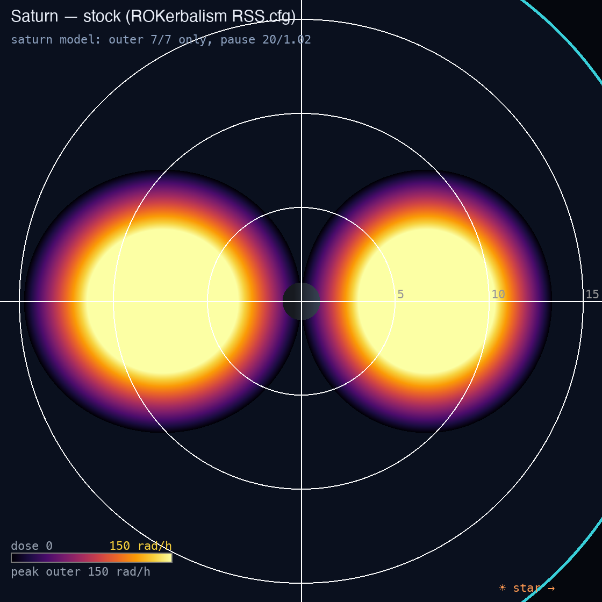 | 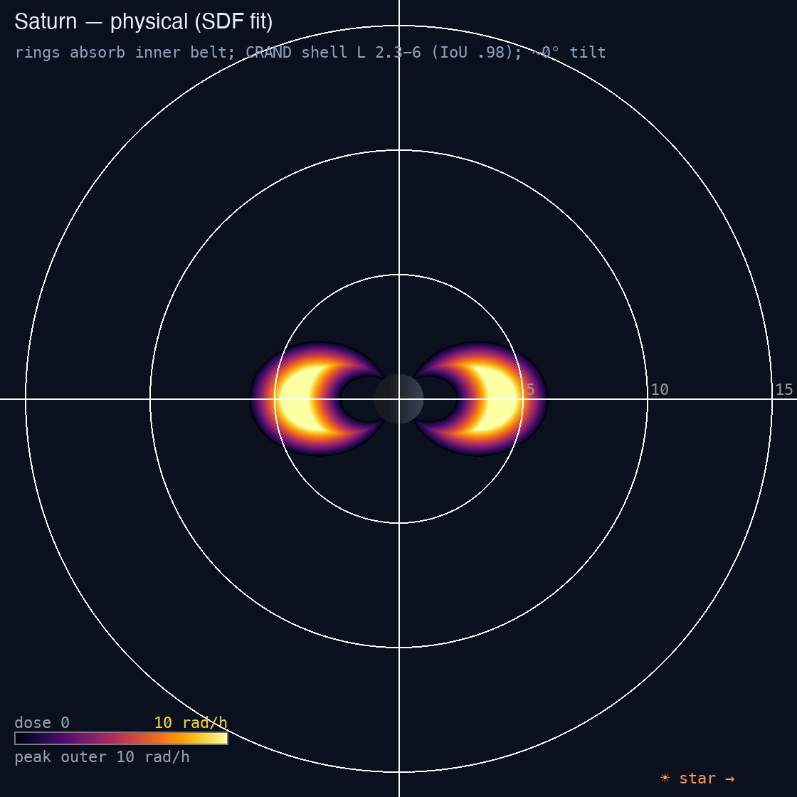 |

| Field | Stock (`saturn` 모델, RSS.cfg) | Physical | Source |
|---|---|---|---|
| has_inner | false (outer only) | **false — correct** (rings absorb) | Cooper 1983 [`1983JGR....88.3945C`](https://ui.adsabs.harvard.edu/abs/1983JGR....88.3945C) |
| pause | 20 / comp 1.02 → 코 19.6 | 코 **~24** (22–27 bimodal) | Achilleos 2008 [`2008JGRA..11311209A`](https://ui.adsabs.harvard.edu/abs/2008JGRA..11311209A) |
| outer belt | 7/7 → 적도 **0–14 R_S** (쓸려나간 고리 영역을 넘쳐 채움) | 셸 **L 2.3–6** (적합 IoU .98), 위성이 잘라낸 통로 | Kollmann 2013 [`2013Icar..222..323K`](https://ui.adsabs.harvard.edu/abs/2013Icar..222..323K) |
| radiation_outer | 150 | **weak** (CRAND-only, ≪ Jupiter) | Kollmann 2017 [`2017NatAs...1..872K`](https://ui.adsabs.harvard.edu/abs/2017NatAs...1..872K) |
| dipole tilt | (near 0) | **<0.007°** (25.2 arcsec!) | Cao 2020 [`2020Icar..34413541C`](https://ui.adsabs.harvard.edu/abs/2020Icar..34413541C) |
| offset | — | 0.047 R_S north | Cao 2020 |

**스톡의 "외대만, 내대 없음"은 물리적으로 옳습니다**. 조밀한 A–C 고리가 정확히 내대가
형성될 자리에 앉아 그것을 흡수합니다(Cooper 1983). 살아남은 벨트는 위성 사이 통로로
잘게 잘립니다(Kollmann 2013, Roussos 2007 [`2007JGRA..112.6214R`](https://ui.adsabs.harvard.edu/abs/2007JGRA..112.6214R)). 공급원이 수동적 CRAND
라 강도는 목성보다 자릿수로 낮습니다(Kollmann 2017). 대기와 D-고리 사이에 얇은 고립
양성자 벨트가 있습니다만(Roussos 2018 [`2018Sci...362.1962R`](https://ui.adsabs.harvard.edu/abs/2018Sci...362.1962R)) — 실재하되 게임플레이엔
무시할 만합니다. 쌍극은 거의 완벽히 축대칭이라(Cao 2020) tilt ≈ 0입니다.

### Uranus

| 스톡 | 물리 |
|---|---|
| 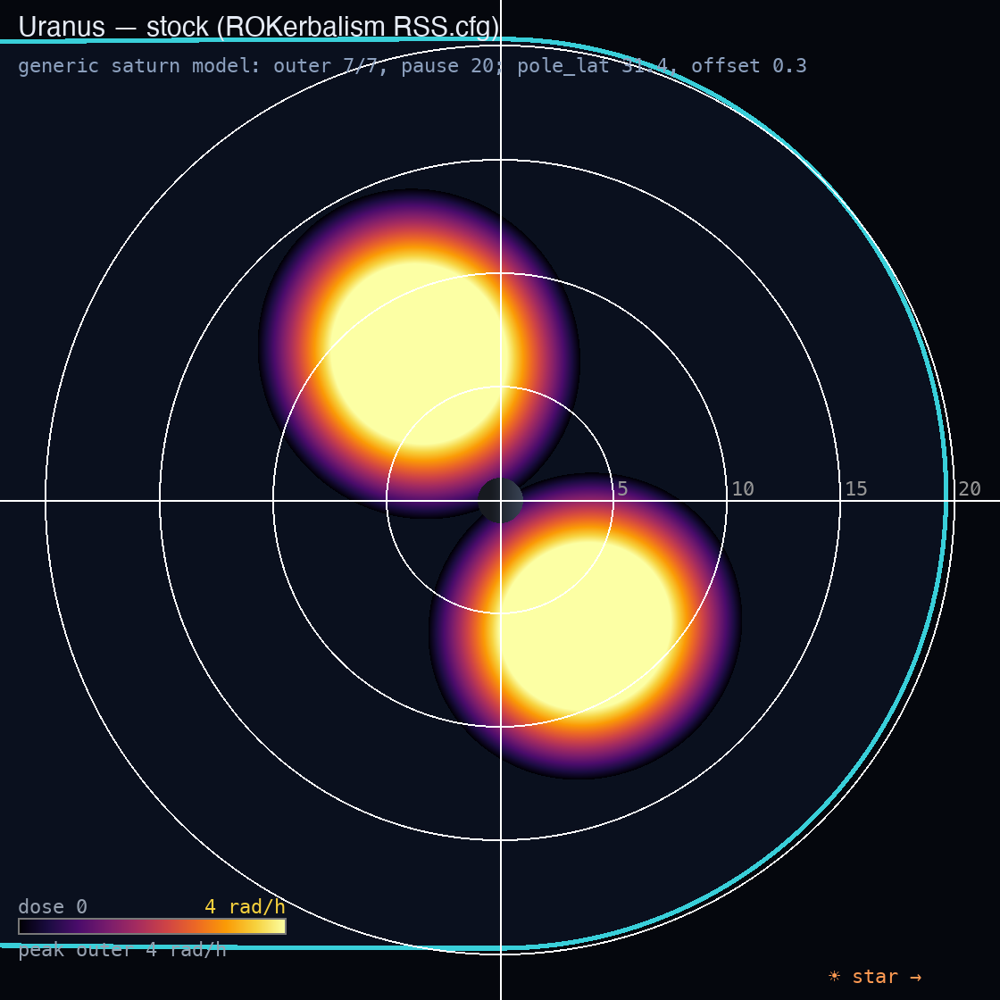 | 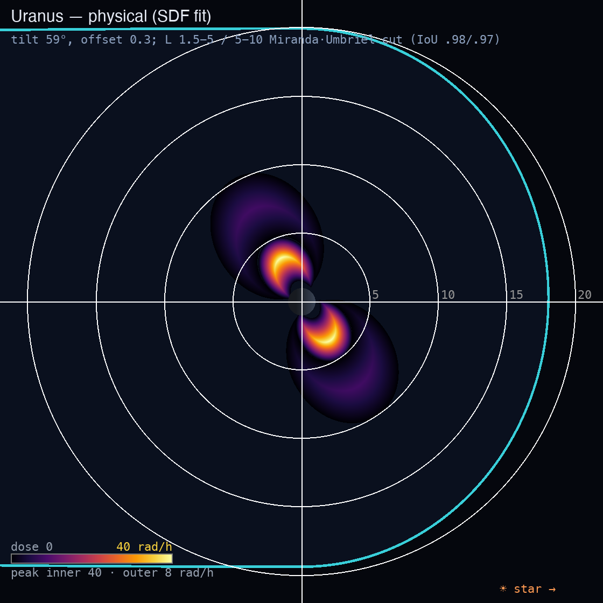 |

| Field | Stock (범용 `saturn` 모델, RSS.cfg) | Physical | Source |
|---|---|---|---|
| geomagnetic tilt | pole_lat 31.4 (=58.6°) | **59–60°** ✓ | Ness 1986 [`1986Sci...233...85N`](https://ui.adsabs.harvard.edu/abs/1986Sci...233...85N) |
| geomagnetic_offset | 0.3 | **0.3 R_U** ✓ | Ness 1986 |
| pause | 20 / comp 1.02 → 코 19.6 | 코 **18.0 R_U** (bow shock 23.7) | Ness 1986 |
| belts | generic `saturn` 외대 7/7 블롭(0–14 R_U). **radiation_inner 75는 죽은 cfg**(`has_inner = false`) | 위성 스위핑이 경계 짓는 두 셸 **L 1.5–5 / L 5–10** — Miranda L 5.1("Miranda 궤도 안쪽 예외역"), 전자 극소가 Miranda/Ariel/Umbriel L 5.1/7.5/10.4에, 그 사이 넓은 극대. 포획은 Titania ~L 17까지 검출(피팅 IoU .98/.97) | Krimigis 1986, Cheng 1987 [`1987JGR....9215315C`](https://ui.adsabs.harvard.edu/abs/1987JGR....9215315C) |
| radiation_inner | 75 (미사용) | e⁻ ≥1.2 MeV, p ≥4 MeV | Krimigis 1986 [`1986Sci...233...97K`](https://ui.adsabs.harvard.edu/abs/1986Sci...233...97K) |
| quadrupole | — | large (Q3 model) | Connerney 1987 [`1987JGR....9215329C`](https://ui.adsabs.harvard.edu/abs/1987JGR....9215329C) |

**스톡은 극단적인 offset-기운 쌍극축을 잡아냅니다**(pole_lat 31.4, offset 0.3). 하지만 場의
*모양*은 범용 `saturn` 모델의 튜닝 안 된 사본(단일 7/7 외대 덩어리, pause 20)이고 해왕성과
그대로 공유됩니다 — 게다가 모델에 내대가 없으므로 그 `radiation_inner = 75`는 결코 발동하지
않습니다. 벨트 강도는 튜닝된 자리채움입니다. 위성들(Miranda→Titania)이 17.24 h마다 거대한
L-범위에 걸쳐 벨트를 쓸어냅니다(Stone 1986 [`1986Sci...233...93S`](https://ui.adsabs.harvard.edu/abs/1986Sci...233...93S)). 태양 쪽을 거의
가리키는 자전축이 꼬리를 나선으로 감아올립니다(pitch 5.5°. Behannon 1987
[`1987JGR....9215354B`](https://ui.adsabs.harvard.edu/abs/1987JGR....9215354B)). 극성 부호는 1차 초록에서 언급되지 않았습니다(지어내지 않음).

### Neptune

| 스톡 | 물리 |
|---|---|
| 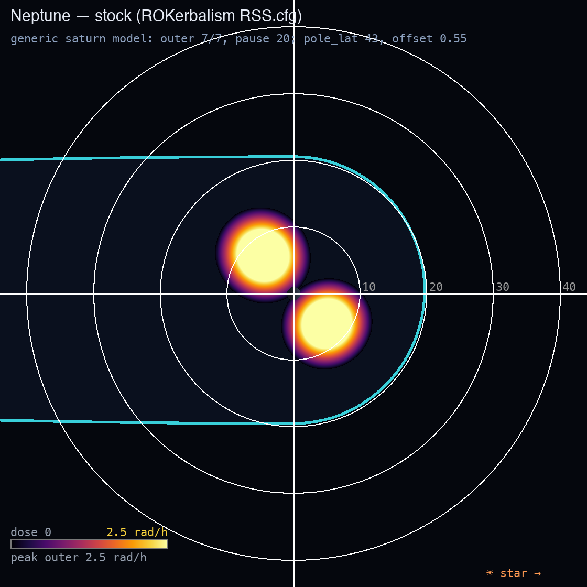 | 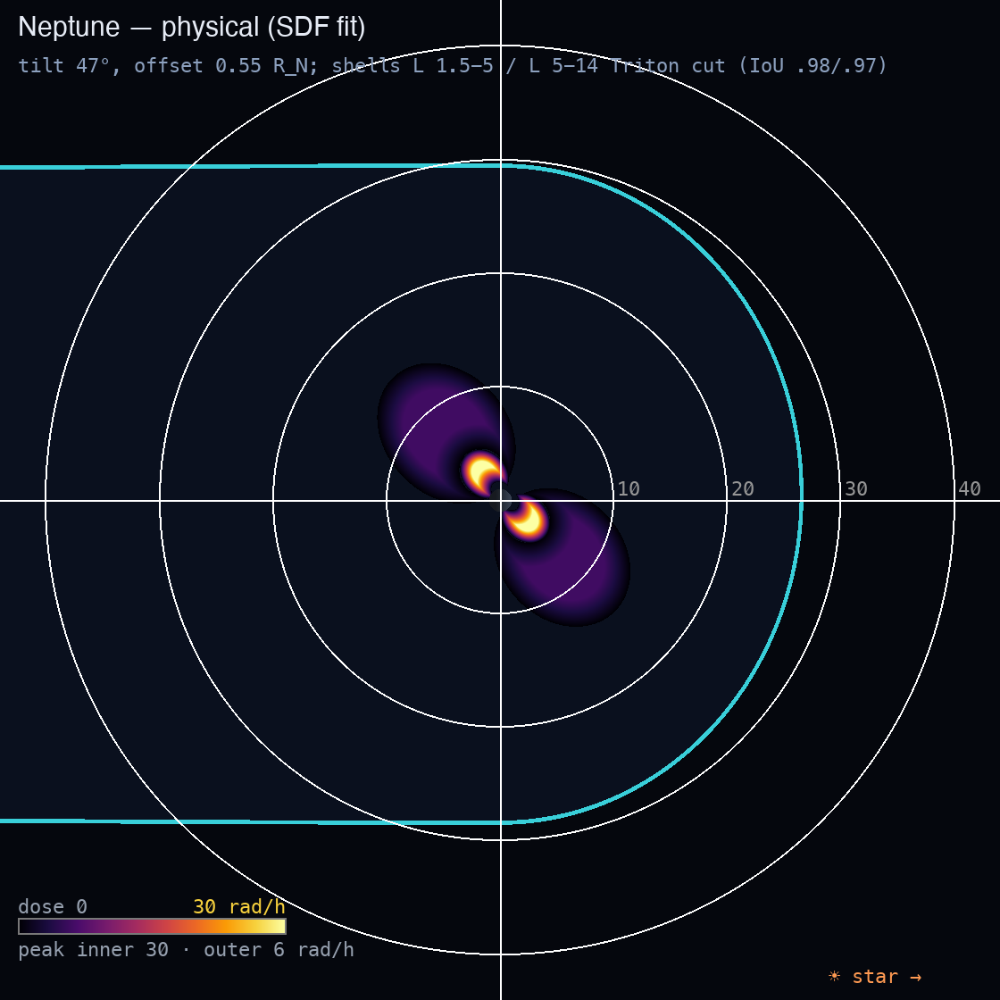 |

| Field | Stock (범용 `saturn` 모델, RSS.cfg) | Physical | Source |
|---|---|---|---|
| geomagnetic tilt | pole_lat 43 (=47°) | **47°** ✓ | Ness 1989 [`1989Sci...246.1473N`](https://ui.adsabs.harvard.edu/abs/1989Sci...246.1473N) |
| geomagnetic_offset | 0.55 | **0.55 R_N** ✓ | Ness 1989 |
| pause | 20 / comp 1.02 → 코 19.6 (이전 개정본은 26.5 ✓라 했으나 — 틀렸고, 모델은 공유된 `saturn` 것임) | 코 **26.5 R_N** (bow shock 34.9) | Ness 1989 |
| belts | 범용 outer 7/7 덩어리; **radiation_inner 39는 죽은 cfg** (`has_inner = false`) | 셸 **L 1.5–5 / L 5–14** (적합 IoU .98/.97), 피크 **L ≈ 7** | Stone 1989 [`1989Sci...246.1489S`](https://ui.adsabs.harvard.edu/abs/1989Sci...246.1489S) |
| outer cutoff | — | **~14 R_N (Triton)** | Krimigis 1989 [`1989Sci...246.1483K`](https://ui.adsabs.harvard.edu/abs/1989Sci...246.1483K) |
| quadrupole/octupole | — | quad ≈ dipole at surface | Connerney 1991 [`1991JGR....9619023C`](https://ui.adsabs.harvard.edu/abs/1991JGR....9619023C) |

천왕성처럼 **스톡이 offset-기운 쌍극축을 잡아냅니다**(tilt 47°, offset 0.55) — 공유된 범용
場 모양 위에 얹은 것입니다. 벨트는 L≈7(Proteus 4.75 R_N 바로 바깥)에서 피크를 찍고, 고리/위성
흡수로 도려집니다(Paranicas 1991 [`1991JGR....9619131P`](https://ui.adsabs.harvard.edu/abs/1991JGR....9619131P)). 바깥은 Triton 궤도에서 딱
잘립니다. 행성 근처의 場은 강하게 비쌍극적입니다(사극/팔극이 쌍극에 맞먹음).

### Mercury

| 스톡 | 물리 |
|---|---|
| 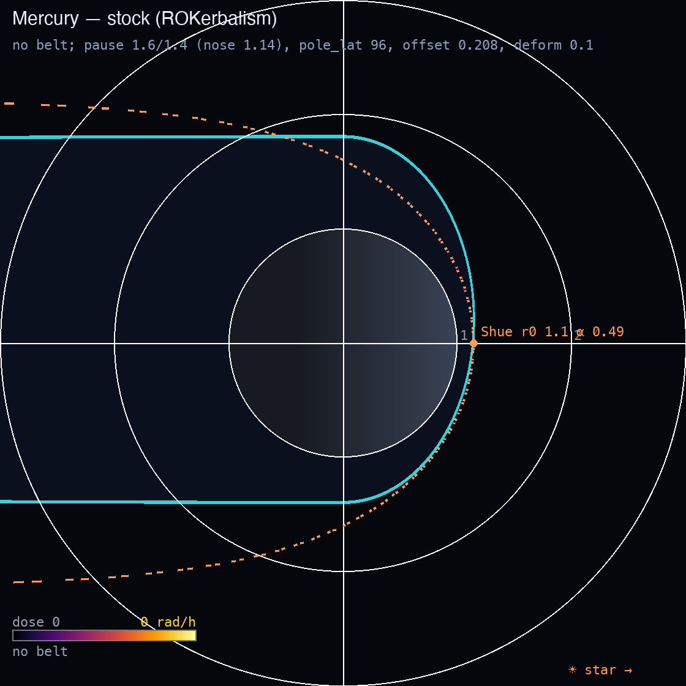 | 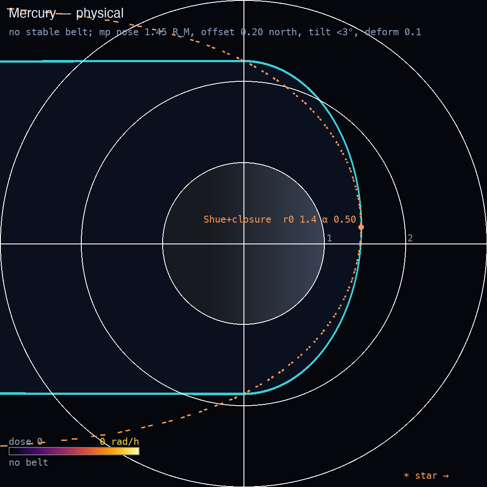 |

| Field | Stock (ROKerbalism `mercury`) | Physical | Source |
|---|---|---|---|
| pause | 1.6 / comp 1.4 → 코 **1.14** | 코 **1.45 R_M** (1.35–1.55, → 1.28 in storms) | Winslow 2013 [`2013JGRA..118.2213W`](https://ui.adsabs.harvard.edu/abs/2013JGRA..118.2213W) |
| belts | none | **none** ✓ (too small/dynamic) | Schriver 2015 [`2015AGUFM.P53A2089S`](https://ui.adsabs.harvard.edu/abs/2015AGUFM.P53A2089S) |
| geomagnetic_offset | 0.208 | **0.198** (484 km north) | Anderson 2011 [`2011Sci...333.1859A`](https://ui.adsabs.harvard.edu/abs/2011Sci...333.1859A) |
| tilt | (small) | **<3°** (<0.8° refined) | Anderson 2011/2012 |
| moment | — | 190–195 nT·R_M³, southward | Anderson 2011, Korth 2015 [`2015JGRA..120.4503K`](https://ui.adsabs.harvard.edu/abs/2015JGRA..120.4503K) |

**스톡이 벨트 없음으로 옳게 모델링합니다** — 수성 자기권은 안정 개체를 가두기엔 너무 작고
동적입니다(준포획된 1–10 keV 적도 구름 + 일시적 버스트만 있음). 북향 offset(484 km ≈ 0.2 R_M)
이 표면 선량을 **남**반구/커스프에 몰아넣습니다. SEP 전자는 열린 자기력선을 타고 거의 즉시
표면에 닿습니다(Gershman 2015 [`2015JGRA..120.8559G`](https://ui.adsabs.harvard.edu/abs/2015JGRA..120.8559G)). 스톡의 코(1.6/1.4 = 1.14 R_M)는
물리값 1.45보다 살짝 *빡빡합니다* — 이전 개정본(pause_radius를 standoff로 읽은)이 말한 것처럼
넉넉한 게 아닙니다.

### Ganymede

| 스톡 | 물리 |
|---|---|
| 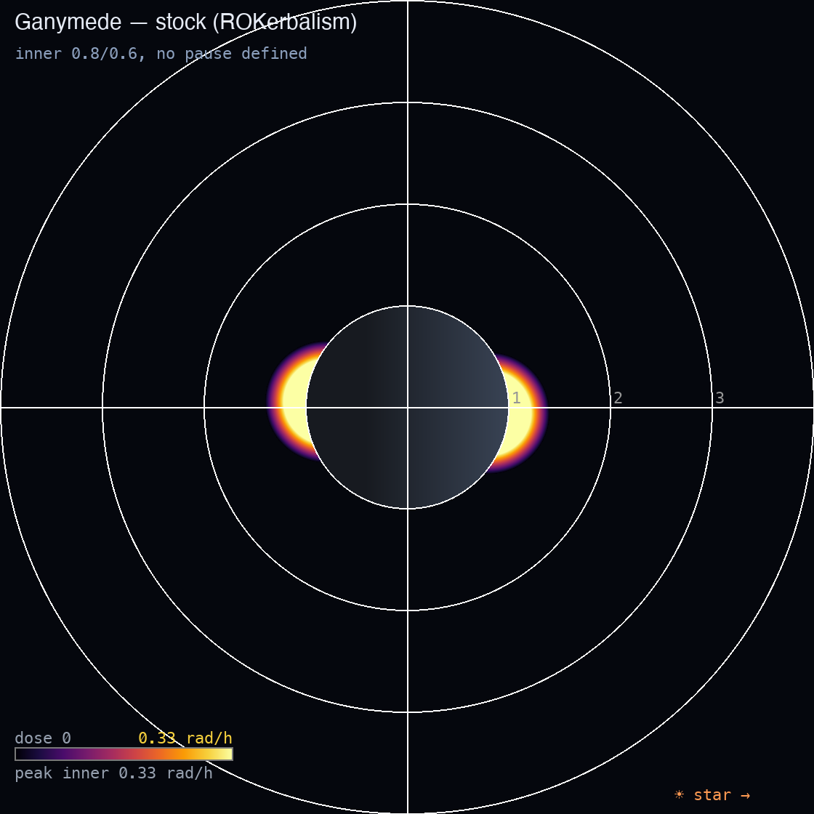 | 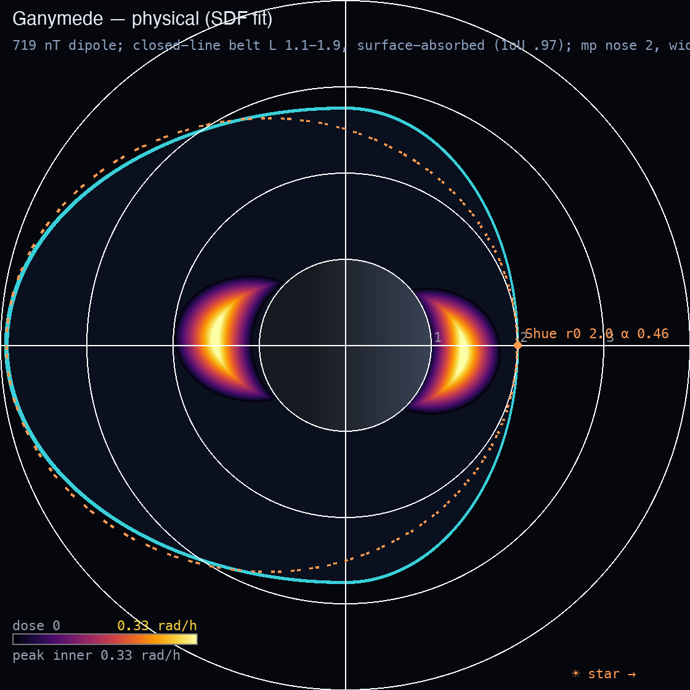 |

| Field | Stock (ROKerbalism `ganymede`) | Physical | Source |
|---|---|---|---|
| surface dipole | (implicit) | **719 nT eq** (tilt 176°) | Kivelson 2002 [`2002Icar..157..507K`](https://ui.adsabs.harvard.edu/abs/2002Icar..157..507K) |
| has_pause | (none) | **~2 R_G upstream** (5.5 across) | Kivelson 1998 [`1998JGR...10319963K`](https://ui.adsabs.harvard.edu/abs/1998JGR...10319963K) |
| inner belt | 0.8/0.6, rad 0.33 | 단일 약벨트 **L 1.1–1.9**, 표면 자체에서 흡수(무대기 — 고도 컷 없음)(피팅 IoU .97), 소스 부족 | Allioux 2013 [`2013AdSpR..51.1204A`](https://ui.adsabs.harvard.edu/abs/2013AdSpR..51.1204A) |
| open caps | — | **poleward of 30–45°** (leaky) | Pappalardo 1998 [`1998DPS....30.5401P`](https://ui.adsabs.harvard.edu/abs/1998DPS....30.5401P) |
| net role | — | **shield −50–60%** of ambient | Allioux 2013 |

**pending 필드 계획** (⚗ — 아래 어느 것도 출하 Kerbalism 에 없습니다). 가니메데의 α 가 0.5 라서
일반화 스톡 형식이 이 경계를 표현할 수 있고, 그래서 이 계획을 받습니다. `pause_radius_smoothed`
**3.9026**, `pause_compression_smoothed` **1.0**, `pause_extension_smoothed` **0.18183**,
`pause_waist` **0.0558**, `pause_smooth` **6.2441**(= radius 의 1.6배). 자신의 연화 Shue 면에
rms 1.9% 로 적합한 값입니다. 출하 3필드는 플러그인이 오기 전까지 그대로 둡니다. 꼬리 비율은 통상
150 이 아니라 노즈의 11.0배로, `150^M_A`(M_A 0.479)에서 나온 아음속 규칙 값입니다.

태양계 유일의 **약장 임베디드 위성** — 거대행성 자기권 안의 다이나모입니다(지오메트리
방법론의 약장 sub-regime). 가니메데의 719 nT는 국소 목성 場을 살짝 넘길 뿐이라 →
작은 ~2 R_G standoff, **열린 극관**(목성과의 재결합), bow shock 없음(sub-Alfvénic → Alfvén
wings. Saur 2018 [`2018ASSL..448..153S`](https://ui.adsabs.harvard.edu/abs/2018ASSL..448..153S)). <~100 keV 이온만 얇은 벨트로 빚어냅니다. 지배적인
선량은 ~15 R_J의 목성 주변 벨트이고, 가니메데의 場은 저궤도 비행체에 대해 그걸 ~50–60%
감쇠시킵니다. **스톡은 pause를 통째로 뺍니다** — 추가할 가치가 있는 수정입니다.

---

## 두-셸 모델이 표현할 수 없는 것 (정밀도 천장)

- **위성/고리 흡수 gap**(토성 통로, 해왕성 Proteus 노치, 천왕성 위성 sweeping) — Kerbalism은
  내대+외대 토러스만 있고 L별 고갈이 없습니다.
- **납작한 magnetodisc의 날카로운 방사상 가장자리** — 최선의 토러스 적합은 렌즈입니다(목성
  외대 IoU 0.87 vs 모든 쌍극형 셸 ≥0.96). 실제 disc는 가장자리가 점점 얇아지므로, 렌즈가
  오히려 판(slab) 타깃 자체보다 자연에 더 가깝다고 볼 수도 있습니다.
- **시간 변동** — 빙거성 벨트는 매 자전마다 흔들립니다(tilt+offset). cfg는 정적입니다.
- **행성 근처 다극 왜곡**(천왕성/해왕성 사극≈쌍극) — 쌍극 `geomagnetic_offset`이 유일한 핸들입니다.
- **제1원리에서 나오는 벨트 강도** — 場 세기가 아니라 공급원/손실/Kennel–Petschek이 지배합니다
  (지오메트리 방법론 Part B 참조). 모든 `radiation_*` 값은 regime 판정이며 신뢰도 low입니다.

# Part 2 — 도출 기록

2026-08-16 에 `planetary-magnetosphere-geometry-methodology.md` 에서 옮겨 왔습니다. 레시피를
적용하는 데는 아무것도 필요하지 않습니다. 여기 있는 것은 어떻게 그 값에 도달했는가, 그리고
대부분은 가는 길에 시도했다 버린 접근들입니다.

본문은 영문 원문을 그대로 둡니다. 기각 사유와 인용이 축자로 보존돼야 하는 기록이고, 다시 쓰면
그 값이 떨어집니다. 각 절이 무엇을 다루는지는 아래 안내를 보십시오.

| 절 | 내용 |
|---|---|
| Why the tail has no derivable length | 꼬리 길이 도출 시도 여덟 번. 일곱째(KH 혼합층)와 여덟째(문헌 조사)가 불가능성을 확정한다 |
| The near-tail X-line | 근-X선 관계식의 등급 판정, 기각된 기준들, 남길 만한 부산물 |
| Induced boundary shape families | 금성·화성 형상족 후보 일곱 개의 실측 오차와 판정 |
| The widest cross-section is pinned to the body plane | 최대 단면을 옮기려다 실패한 두 접근(`smooth` 오용, `pause_offset`) |

## Why the tail has no derivable length

**Seventh attempt, 2026-08-16: the boundary never fades, so there is no fade point.**
The idea was to end the tail where the inside/outside contrast blurs, and to let a
weak-field body get a proportionally shorter tail than a strong one. Three calculations
kill it.

The lobe field is set by pressure balance, `B_lobe = sqrt(2 mu0 P_ext)`, which depends on
the ambient wind at that orbital distance and **not at all on the planet's own field**. It
therefore does not decay downtail: at each station the boundary re-balances against the
same external pressure.

The lobes are Kelvin-Helmholtz stable. With the lobe field aligned to the flow, the
instability threshold `dv^2 > (1/mu0)(1/rho_1 + 1/rho_2)(B_1^2 + B_2^2)` puts the critical
shear at 1540 to 1880 km/s along Earth's distant tail, against a magnetosheath flow of
~400. The boundary layer does not turbulently thicken, so a mixing-layer criterion never
consumes the tail radius (Miura 1987, [`1987JGR....92.3195M`](https://ui.adsabs.harvard.edu/abs/1987JGR....92.3195M);
Walker 1981, [`1981P&SS...29.1119W`](https://ui.adsabs.harvard.edu/abs/1981P%26SS...29.1119W)).

And the contrast itself is scale-free: dividing the two expressions gives
`B_lobe / B_IMF = sqrt(2) * M_A`, a **constant along the tail**, because both fields fall
off the same way. Earth 13.5x, Jupiter 14.7x, Polyphemus 13.5x. The tail interior stays
an order of magnitude above its surroundings forever.

One byproduct is worth keeping: `sqrt(2) * M_A` is a cheap contrast diagnostic that needs
no field model. Proxima b scores **4.5x** against everyone else's 13 to 15, because its
wind is nearly Alfvenic (M_A ~ 3) - its tail is a genuinely faint structure, even though it
is not a short one.

Also retracted here: an intermediate step in that attempt backed a shear-layer spreading
rate `S = R_T / L` out of the published tail extents and read the spread (Earth 0.13,
Jupiter 0.014) as a physical difference in tail length. It is not. Every `L` is a
spacecraft-coverage bound, so every `S` is an upper bound, and the spread measures how far
each mission flew, not how long each tail is.

**A real termination mechanism does exist, and it is topological rather than diffusive**
(three-agent literature sweep, 2026-08-16). The tail is not erased by fading; it is *cut*.
Kurth 1982 ([`1982JGR....8710373K`](https://ui.adsabs.harvard.edu/abs/1982JGR....8710373K)) conjectured a "pinch-off or disconnection" of the
distant Jovian tail, and Goldstein 1985 ([`1985JGR....90.8223G`](https://ui.adsabs.harvard.edu/abs/1985JGR....90.8223G)) confirmed it: an
interplanetary sector crossing appeared in the Voyager 1 solar-wind data during the event,
"as predicted by Kurth et al. (1982). This supports their conjecture that the tail had
disconnected from Jupiter." This is the planetary counterpart of a cometary disconnection
event. The same paper finds the distant-tail magnetic spectra at 6000–7500 R_J follow
`f^−5/3`, indistinguishable from the ambient wind.

That gives a computable length: the attached tail can only grow for as long as the planet
goes between current-sheet crossings, so `L = v_wind × T_sector`, where `T_sector` is the
synodic period of the two-sector pattern (stellar rotation / 2) against the orbit. Every
Solar-System planet lands near **3 AU** (12.7–13.5 d sector period against a 400 km/s
wind), which is where the distant detections actually sit — Jupiter 4.5 AU, comet Hyakutake
3.8 AU. NearStars: Polyphemus 2.58 AU, Proxima b 12.83, Proxima c 35.5, Proxima d 4.89.

**Computed and deliberately not adopted** (owner decision 2026-08-16). Two reasons. It
agrees with `150 × nose` for the giants (Jupiter 6157 against 9450 R_J, Polyphemus 5398
against 5300) and diverges by two to three orders of magnitude for small bodies, because it
is an absolute distance rather than a multiple of the nose — Venus would go from 158 to
76,868 R_V, whose `extension` of 1.5e-5 is a cylinder that never visibly closes. And the
mechanism is a *duty cycle*, not a wall: the severed tail keeps travelling, which is why
comet 153P was detected 6.5 AU downstream (Jones 2022, [2006.00500](https://arxiv.org/abs/2006.00500)) and why
Jones argues some ion tails "may survive as recognizable structures to the edge of the
heliosphere."

**The flux budget does not terminate the tail either.** The premise — that the tail ends
where its finite open flux has all reconnected — fails on measurement: Slavin 1985
([`1985JGR....9010875S`](https://ui.adsabs.harvard.edu/abs/1985JGR....9010875S)) finds flaring ceases at |X| = 120 ± 10 R_E with `B_L` = 9.2 nT
and a 60 R_E diameter both **constant out to 225 R_E**, so the lobe flux is flat at the full
polar-cap value rather than draining. Milan 2004 ([`2004JGRA..109.7210M`](https://ui.adsabs.harvard.edu/abs/2004JGRA..109.7210M)) built the
model anyway and reports the length "can vary by almost a factor of 10, between ~400 and
4000 R_E, in just a few hours", adding that "a much longer disconnected tail and wake can
exist beyond this". A quantity that moves 3600 R_E in three hours is not an edge. It does
leave a useful internal marker: the boundary between the Dungey-connected tail and the
disconnected wake, 400–4000 R_E at Earth, which brackets our 1500.

**The one field that has solved this problem is heliotail research, and its solution does
not transfer.** Izmodenov & Alexashov 2003 ([astro-ph/0308211](https://arxiv.org/abs/astro-ph/0308211)) state the difficulty
in our own terms — "in the heliotail we cannot assume the heliopause to be the heliospheric
boundary … the solar wind fills the whole space into the downwind direction" — and then get
numbers only by invoking charge exchange with interstellar neutrals: the density and
tangential-velocity jumps vanish at **~3000 AU**, and the plasma converges to interstellar
values at **20,000–40,000 AU**. Their summary sentence is the one to carry: "unlike the
upwind direction the solar system boundary has **diffusive nature** in the heliotail." A
planetary magnetotail sits in a fully ionised magnetosheath and has no comparable neutral
sink, which is exactly why no equivalent number exists for planets.

## The near-tail X-line

**The comparison only works if the same structure is compared.** An earlier pass put Earth's
*distant* neutral line (100–140 R_E, 10–14 `r₀`) beside everyone else's *near* line and
concluded the scatter was 12×, which killed several candidate recipes. The names carried the
answer: Mercury's is literally the "Near-Mercury Neutral Line". Compared like with like the
spread is **1.04–3.00, a factor of 2.9**, and Earth's distant line is a separate structure
measured nowhere else.

Two refinements are available, and they differ in how much they can be trusted.

**Grade: empirical, anchors reproduced, predictive power unverified.** Two things keep it
from being more. There is no fourth body to test it on — Neptune's tail has no plasmoid or
X-line measurement (searched 2026-08-15). And the grouping rationale is contested: Turner
2024 ([`2024JGRA..12932723T`](https://ui.adsabs.harvard.edu/abs/2024JGRA..12932723T)) places Uranus in a **third** category, "unlike the other
magnetospheric systems that are Dungey-cycle driven (i.e., Mercury and Earth) or
rotationally driven (Jupiter and Saturn)", and Gershman 2020 ([`2020EPSC...14..258G`](https://ui.adsabs.harvard.edu/abs/2020EPSC...14..258G))
reports Voyager 2 measuring `M_A` ~23 at Uranus with a plasmoid "suggestive of more internal
planetary plasma driven" transport. That encounter's geometry is itself extreme — the
rotation axis pointed within ~8° of the Sun, so the 59° dipole tilt swept the current sheet
through a full turn each rotation, against a 24° flap at Earth; it is laid out in
[`uranus-geometry.html`](../../../docs/uranus-geometry.html). So Uranus may not belong with Mercury and Earth at all,
even though it lands on their line. Neptune is the first test if a measurement ever appears.

For an exoplanet the recipe needs nothing but `r₀`, which Part A already produces:

    strong internal plasma source (Io/Enceladus-class torus + fast rotation)
        X ≈ 1.16 · r₀
    otherwise
        X ≈ (−0.420 + 0.6055 · log₁₀ r₀[km]) · r₀        fall back to 1.9 · r₀ if unsure

**This is not the tail length, and Shue has no tail length.** The Shue family has exactly two
parameters, `r₀` and `α`: `r₀ · 2^α` is the terminator width, and α alone fixes the far-tail
behaviour — below 0.5 the width decays to zero asymptotically, at exactly 0.5 the tail is a
cylinder of radius `2 r₀`, above 0.5 it diverges (Winslow 2013 states the same threshold:
"a … governs whether the magnetotail is closed (a<0.5) or open (a≥0.5)"). **No α yields a
finite endpoint.** `pause_extension`'s `L` is therefore an engine artifact — the place the
bounded cfg volume closes — not a physical quantity, and it must be placed outside the
measured range or it destroys the widths α reproduces.

**Criteria tried and rejected**, recorded so none is re-attempted:

| criterion | why it failed |
|---|---|
| lobe pressure = ambient static pressure | pressure balance is satisfied indefinitely; beyond flaring cessation the tail is a constant-radius cylinder (Slavin 1985: `B_L` fixed at 9.2 nT past 120 R_E) |
| flaring cessation as `L` | it is where the *shape* stops changing, not where the tail closes; setting `L` = 120 R_E drove Earth's width to zero exactly where 30 R_E is measured |
| nose-contrast threshold | the contrast excess at cessation is 5.3% at Earth against 32.7% at Mercury |
| "fully interior region vanishes" (contrast × cross-section) | the only criterion that stays finite for every α, and the closest yet — but Earth 1.57% vs Mercury 5.94%, and Saturn's α 0.736 pushes its answer to 676 `r₀` |
| 12 × nose, Earth-calibrated | falsified by Mercury; its claimed Jupiter check used Kurth 1981's ">700 R_J" (a lower bound on brief encounters) when Lepping 1983 ([`1983JGR....88.8801L`](https://ui.adsabs.harvard.edu/abs/1983JGR....88.8801L)) documents ≥9000 R_J |

**One side result worth keeping.** At the stagnation point the balance is
`B²/2μ₀ = k·P_dyn`, so the pressure contrast against the ambient static pressure is
`k·P_dyn/P_static` — and because both scale as `r⁻²` with heliocentric distance, that ratio
is **the same 48.7× at every planet**. It gives the magnetopause nose field directly for any
body, `B = √(2μ₀ k P_dyn)`, which returns 62 nT at Earth against an observed 60–70 nT.
Useful for exoplanets, where `P_dyn` follows from the stellar wind.

## Induced boundary shape families, measured and rejected

Every alternative was measured before this one was adopted, and each is recorded so it is
not re-attempted:

| candidate | nose | terminator | wake | verdict |
|---|---|---|---|---|
| stock, unmodified | −15% | +47% | −47% | both measured values wrong |
| Shue, α = log₂(comp) | 0.00% | +0.9% | −83% … −100% | tail vanishes 2 R_p behind the planet |
| Shue, α ≈ 0.44 (min-max fit) | 0.00% | +23% | ±31% | `pause_alpha` and `pause_compression` would describe different daysides |
| softened Shue, α and L fitted | 0.00% | +32.5% | −32.5% | best the family allows; ε ≪ 0.5 whenever L ≫ r₀, so the terminator collapses to r₀·2^α |
| conic about a focus | — | — | +60% | closed as an ellipse it dips to 0.9745 R_V, **below the surface** |
| circle + cone + closure cap | 0.00% | 0.00% | 0.00% | exact, but needs a shape family of its own |
| **generalized stock** | **0.00%** | **0.00%** | −15% … −54% | adopted |

## The widest cross-section is pinned to the body plane

This does **not** fix the tail-width deficit — that needs the Shue-native mode. A first
attempt to use `pause_smooth` for the width, by fitting it against the Shue curve rather
than against the corner, drove it to 3 × nose and turned the piecewise-linear `px` into a
quadratic. That is a change of function family, not a smoothing, and was rejected.

The nose comes out exact (1.0545 / 1.29) and the tail closes at
158 / 194 R_p (the 150 x nose convention; an earlier revision of this table carried
`extension` 0.0567 / 0.0737, a 20 R_p closure from before that convention existed, which
the shipped presets had already moved past), and the bulge is 0.000% against the
`pause_radius` cap. The terminator section is 3.3% / 3.5% narrower than the cap, because
smoothing moves the widest plane downstream; both were previously stated as exact, an error
that came from applying the smooth-free identity `nose = pause_radius/compression` to a
smoothed surface (found 2026-08-17, together with the same bug in the viewer's read-back).
The other cost is wake width: against the measured cone the
boundary is 15% narrow at 2 R_p, 33% at 5 and 54% at 10 — accepted, because no-bulge
outranks wake fidelity here, and because every Shue parameterization does far worse
(−83% to −100%; see Part A).

**`pause_offset`** is the cheap fallback if the full Shue mode is rejected: shift
the sphere centre tailward before the scaling (`p.x += pause_offset`), which fixes
the "widest at the body plane" defect in one line. A least-squares fit against the
softened Shue curve for Proxima c (nose 11.905, α 0.5, tail 125) reproduces the
nose, the body-plane width, the maximum width and the tail closure within a few
percent at `pause_offset` 19.7 / radius 21.5 / compression 0.68 / extension 0.204.
Every shipped stock and ROKerbalism pause underrepresents tail width the same way
(Earth flank 15 vs an observed 25–30 R_E tail radius), so this is a general defect,
not a NearStars quirk.

## Night-side alpha, trialled and rolled back

2026-08-16 시도, 같은 날 기각. 목적은 아트였습니다. 오너가 행성 뒤 꼬리가 너무 뚱뚱하다고 보아,
야간면에 주간면 피팅값보다 낮은 Shue α 를 주어 폭을 줄이려 했습니다.

세 변형을 만들어, 행성 꼬리 폭이 실제로 측정된 유일한 지점인 Slavin 1985 의 x = −120 R_E 반경 30 에
견주었습니다.

| 변형 | α 혼합 방식 | x = −120 폭 | 실측 대비 |
|---|---|---|---|
| 단일 α 0.58 | — | 27.9 | −7.0% |
| 야간 0.48, 각도 기준 | θ 90°→180° smoothstep | ~18.0 | −40.1% |
| 야간 0.52, 각도 기준 | 같음 | 22.1 | −26.5% |
| 야간 0.52, 거리 기준, 0.66 L 에서 시작 | 꼬리 34% 지점까지 무손상 | 27.9 | −7.0% |
| 야간 0.52, 거리 기준, 0.66 L 에서 완료 | 꼬리 34% 지점에서 혼합 종료 | 27.0 | −10.1% |

각도 기준 혼합이 원래 구현이었고, 경계가 행성 바로 뒤에서 좁아지는 것처럼 보이던 원인입니다.
θ 90°→180° 의 대부분이 근꼬리에 대응해, θ = 120°(지구 x = −11 R_E)에서 이미 혼합이 33% 진행됩니다.
혼합을 하류 *거리* 로 옮기면 그 쏠림이 사라지고, 거리 기준 두 변형 모두 Slavin 정합을 지킵니다.

그래도 보기 좋지 않았고, 원인은 α 가 아니었습니다. 연화 Shue 의 닫힘 테이퍼가 `m` = 1 로 고정돼 있어
닫힘이 꼬리 절반에 걸쳐 진행됩니다 — L 의 70% 지점에서 이미 폭이 19% 줄어듭니다. "중간에서 좁아진다"고
읽히는 것은 α 혼합이 아니라 그것입니다. `m` 을 키우면 L 의 80% 까지 폭을 유지하다 급히 닫히지만,
`m` 은 이전 오너 결정으로 1 에 고정돼 있어 다시 여는 것은 범위 밖이었습니다.

전면 롤백. 모든 천체가 단일 α 를 유지하고, 야간면 슬라이더는 어떤 천체도 설정하지 않는 탐색용 노브로
뷰어에 남습니다. 다시 볼 일이 생기면 집어들 것은 `m` 쪽입니다.

## 틀렸던 첫 시도와 철회

방법론 문서가 자기 역사를 들고 다니지 않아도 결론만 말할 수 있게, 여기 모아 둡니다.

**아음속 꼬리 비율을 선형으로 줄인 것.** 첫 형태는 `ratio = max(150·M_A, 1)` 였습니다. 위쪽 끝은
맞고 아래쪽이 틀립니다 — A b III 의 `M_A` 0.0096 이 노즈보다 44% 긴 꼬리를 요구하는데, 주야 압력비
`(1 + 2M_A²)^(1/6)` 가 함의하는 값은 0.01% 입니다. 채택한 `150^M_A` 는 거기서 5%, 가니메데에서 노즈의
11배를 주고, `M_A` 0 에서 정확히 구가 됩니다(2026-08-17).

**`pause_smooth` = 0.5 × radius 를 일반화한 것.** 그 관례는 유도 갈래에서 잰 값이고 옮겨가지 않습니다.
적합 최적은 꼬리가 짧아질수록 커집니다 — 수성 1.47배, 가니메데 1.6배, A b III 4.0배(2026-08-17).

**"일반화 스톡은 이 α 대역에서 꼬리가 70% 어긋난다"** — 수성 뷰어 프리셋 주석. 70% 는 목성(α 0.423)의
값입니다. α 0.5 는 오히려 그 형식이 맞는 지점이라 수성은 rms 0.88% 로 적합되고, 그래서 두 계획을 다
들고 갑니다(2026-08-17).

**dose-anchor 보간을 K–P 스케일링이라 부른 것.** `dose ≈ 10.4 × (B_eq/31 µT)^1.9` 는 감사된 포화
dose 앵커 두 개 사이의 경험적 보간이고 경도(hardness)와 벨트 크기 효과를 함께 묶은 값입니다.
Kennel–Petschek 이 아닙니다.

**"자이언트 자기권계면은 Shue 형식으로 적합된 적이 없다."** 틀렸습니다. Rutala 2025 가 목성을 바로 그
형식으로 적합하고 Arridge 2006 이 토성을 적합합니다. 방법론의 적합 α 표가 그 정정입니다.

**`pause_deform` 을 장식이라고 본 것.** Kerbalism 모딩 문서가 "사인파 합으로 표면을 변형"이라고만
써 둔 데서 온 오독입니다. ROKerbalism 은 물리로 씁니다 — `mercury` 와 `irregular` 모델이 둘 다 0.1,
`metallic` / `solidiron` / `anomaly` 가 0.04~0.1 입니다.

## 인용 (ADS 핀, 바디별)

- **Jupiter**: Joy 2002 [`2002JGRA..107.1309J`](https://ui.adsabs.harvard.edu/abs/2002JGRA..107.1309J); Divine & Garrett 1983 [`1983JGR....88.6889D`](https://ui.adsabs.harvard.edu/abs/1983JGR....88.6889D);
  Connerney 2022 (JRM33) [`2022JGRE..12707055C`](https://ui.adsabs.harvard.edu/abs/2022JGRE..12707055C); Santos-Costa 2001 [`2001P&SS...49..303S`](https://ui.adsabs.harvard.edu/abs/2001P%26SS...49..303S);
  Khurana 1989 [`1989JGR....9411791K`](https://ui.adsabs.harvard.edu/abs/1989JGR....9411791K).
- **Saturn**: Cooper 1983 [`1983JGR....88.3945C`](https://ui.adsabs.harvard.edu/abs/1983JGR....88.3945C); Achilleos 2008 [`2008JGRA..11311209A`](https://ui.adsabs.harvard.edu/abs/2008JGRA..11311209A);
  Kollmann 2013 [`2013Icar..222..323K`](https://ui.adsabs.harvard.edu/abs/2013Icar..222..323K); Kollmann 2017 [`2017NatAs...1..872K`](https://ui.adsabs.harvard.edu/abs/2017NatAs...1..872K); Roussos 2007
  [`2007JGRA..112.6214R`](https://ui.adsabs.harvard.edu/abs/2007JGRA..112.6214R); Roussos 2018 [`2018Sci...362.1962R`](https://ui.adsabs.harvard.edu/abs/2018Sci...362.1962R); Cao 2020 [`2020Icar..34413541C`](https://ui.adsabs.harvard.edu/abs/2020Icar..34413541C).
- **Uranus**: Ness 1986 [`1986Sci...233...85N`](https://ui.adsabs.harvard.edu/abs/1986Sci...233...85N); Krimigis 1986 [`1986Sci...233...97K`](https://ui.adsabs.harvard.edu/abs/1986Sci...233...97K); Cheng 1987 [`1987JGR....9215315C`](https://ui.adsabs.harvard.edu/abs/1987JGR....9215315C); Stone
  1986 [`1986Sci...233...93S`](https://ui.adsabs.harvard.edu/abs/1986Sci...233...93S); Connerney 1987 [`1987JGR....9215329C`](https://ui.adsabs.harvard.edu/abs/1987JGR....9215329C); Behannon 1987
  [`1987JGR....9215354B`](https://ui.adsabs.harvard.edu/abs/1987JGR....9215354B).
- **Neptune**: Ness 1989 [`1989Sci...246.1473N`](https://ui.adsabs.harvard.edu/abs/1989Sci...246.1473N); Krimigis 1989 [`1989Sci...246.1483K`](https://ui.adsabs.harvard.edu/abs/1989Sci...246.1483K); Stone
  1989 [`1989Sci...246.1489S`](https://ui.adsabs.harvard.edu/abs/1989Sci...246.1489S); Connerney 1991 [`1991JGR....9619023C`](https://ui.adsabs.harvard.edu/abs/1991JGR....9619023C); Paranicas 1991
  [`1991JGR....9619131P`](https://ui.adsabs.harvard.edu/abs/1991JGR....9619131P).
- **Mercury**: Winslow 2013 [`2013JGRA..118.2213W`](https://ui.adsabs.harvard.edu/abs/2013JGRA..118.2213W); Anderson 2011 [`2011Sci...333.1859A`](https://ui.adsabs.harvard.edu/abs/2011Sci...333.1859A);
  Schriver 2015 [`2015AGUFM.P53A2089S`](https://ui.adsabs.harvard.edu/abs/2015AGUFM.P53A2089S); Gershman 2015 [`2015JGRA..120.8559G`](https://ui.adsabs.harvard.edu/abs/2015JGRA..120.8559G); Korth 2015
  [`2015JGRA..120.4503K`](https://ui.adsabs.harvard.edu/abs/2015JGRA..120.4503K).
- **Ganymede**: Kivelson 2002 [`2002Icar..157..507K`](https://ui.adsabs.harvard.edu/abs/2002Icar..157..507K); Kivelson 1998 [`1998JGR...10319963K`](https://ui.adsabs.harvard.edu/abs/1998JGR...10319963K);
  Kivelson 1996 [`1996Natur.384..537K`](https://ui.adsabs.harvard.edu/abs/1996Natur.384..537K); Pappalardo 1998 [`1998DPS....30.5401P`](https://ui.adsabs.harvard.edu/abs/1998DPS....30.5401P); Allioux 2013
  [`2013AdSpR..51.1204A`](https://ui.adsabs.harvard.edu/abs/2013AdSpR..51.1204A); Saur 2018 [`2018ASSL..448..153S`](https://ui.adsabs.harvard.edu/abs/2018ASSL..448..153S).

## Related

- [`planetary-magnetosphere-geometry-methodology.md`](planetary-magnetosphere-geometry-methodology.md)
  — 이 감사가 렌더하는 場 모양 레시피 + Kerbalism SDF 스키마.
- `scripts/viz/fit_belts.py` — 수치 적합기(쌍극-셸 타깃 → SDF 파라미터, IoU 채점).
  적합된 파라미터 세트는 `render_belts_bodies.py`에 들어 있습니다.
- [`planetary-dynamo-scaling.md`](planetary-dynamo-scaling.md) /
  [`rocky-planet-dynamo-methodology.md`](rocky-planet-dynamo-methodology.md) — B-field
  입력값.
- 발행 페이지(렌더 포함): [태양계 방사선대](https://vannadin.github.io/nearstars-db/wiki/reference__solar-system-radiation-belts.html)
  (단면 이미지).
- [methodology-index](methodology-index.md).

## Fitting the stock form to Shue, and why it was rejected

2026-08-16 시도. Shue-native 엔진 모드를 통째로 없애려는 시도였습니다. 일반화 스톡 pause 를 Shue
목표 곡면에 오프라인으로 피팅해 네 숫자만 내보내자는 것이었고, 거의 성공했습니다. 실패한 이유가
남길 만합니다.

`r0` 로 정규화하면 이 피팅은 α 만의 함수입니다. α 가 같은 바디들이 `rad/r0`·`waist/r0`·`ext`·
`smooth/rad` 네 값 모두 소수 넷째 자리까지 일치합니다. 최적화가 잡음이 아니라 구조를 찾고 있다는
검증입니다. `compression` 은 모든 경우에 1.0 으로 은퇴합니다. 최대 단면을 바디 평면에 못 박는데
실제 경계의 최대폭은 행성 뒤에 있고, 그 지점을 옮길 수 있는 손잡이는 `waist` 뿐이기 때문입니다.

품질은 α 가 0.5 에서 얼마나 떨어져 있느냐에 전적으로 달렸습니다. 스톡의 폭 `√(radius² − px²)` 은
본래 원기둥인데 Shue 의 꼬리는 `u^(1−2α)` 로 가기 때문입니다.

| 바디 | α | 1−2α | 주간면 최대오차 | 0.9 L 꼬리 오차 |
|---|---|---|---|---|
| 목성·폴리페무스 | 0.42 | +0.15 | 4.2% | **+70%** |
| 수성 | 0.500 | 0.00 | 0.26% | +0.7% |
| 지구·천왕성·해왕성·프록시마 c/d | 0.580 | −0.16 | 1.12% | −5.7% |
| 토성 | 0.736 | −0.47 | 4.5% | **−42%** |

네 α 등급 중 둘이 IMF `Bz` 가 실제 경계를 흔드는 ±20% 보다 크게 빗나갑니다. "인코딩 오차가
인코딩 대상보다 작다" 는 주장은 α 0.5 근처에서만 참이었습니다. 기각.

가드 셋이 이 시도에서 나왔고, 앞으로 이런 종류의 피팅에는 재사용할 만합니다. 없으면 제약 없는
최소제곱이 주간면을 꼬리 정확도와 맞바꿉니다. 토성이 θ = 15° 에서 폭 −100%, 즉 주간면 전체가
사라진 채로 총 rms 는 더 좋은 해가 나왔습니다. 노즈를 정확히 고정하고, `waist` 를 `0.95 r0` 아래로
묶어 혼합 원점이 주간면을 삼키지 못하게 하고, 주간면 오차에 명시적 상한을 걸어야 합니다.

이 시도는 대안에 대한 틀린 전제 위에 서 있기도 했고, 여기서 정정합니다. Shue-native 가 극형식을
진짜 직교 부호거리로 바꿔야 한다고 적혀 있었는데, Kerbalism 은 진짜 거리를 요구하지 않습니다.
스톡 pause 자체가 유사거리입니다(`compression` 으로 `x` 를 늘리면 계량이 깨집니다). 안에서 음수·
밖에서 양수면 되므로 Shue 의 `Pause_func` 은 다섯 줄입니다. 진짜 추가는 `Pause_domain()` 하나이고,
연화 Shue 곡선의 바운딩 박스는 닫힌 형태가 없습니다.

변환기는 `scripts/refs/magnetopause_geometry.py` 의 `shue_to_stock()` 로 남깁니다. 위 내용을 전부
측정한 도구입니다.

## Particle-mesh sampling cost at long tails (noted, not fixed)

Kerbalism 은 방사선장을 경계 껍질에 뿌린 입자 25만 개로 그리고, 그 입자는 거부 표집으로 찾습니다
(`src/Kerbalism/Renderer/ParticleMesh.cs`).

    p = 바운딩 박스 안의 난수점
    D = dist_func(p)
    if (D <= 0 && D > -thickness) 채택            // thickness = 1 / quality
    particle_count 를 채우거나 particle_count * 1000 표본에서 중단

점은 *박스 전체* 에 던지고 얇은 껍질에 든 것만 남기므로, 비용은 박스 부피에 비례하고 수확은 껍질
부피에 비례합니다. `Pause_domain()` 이 박스를 `rad/ext` 로 잡는데 150×노즈 꼬리 관행이 그것을 아주
길게 만들고, 우리는 스케일과 무관하게 모든 바디에 `pause_quality` 30 을 내보냅니다. 노즈가 1.2 든
63 이든 두께 0.033 바디반경짜리 껍질입니다.

대략적인 채택률입니다(껍질을 원기둥으로 근사했으므로 자릿수 수준의 값입니다).

| 바디 | 박스 x 반폭 | 채택률 | 2.5억 표본 상한에서 얻는 입자 |
|---|---|---|---|
| 목성 | 4757 | 0.062% | ~155,000, 즉 **목표의 62%** |
| 토성 | 1812 | 0.130% | 달성 |
| 지구 | 755 | 0.348% | 달성 |
| 수성 | 109 | 2.5% | 달성 |

상한에 걸리는 것은 목성뿐이고 결과는 미관 문제입니다. 자기권계면 오버레이가 성기게 그려지고,
로드 스레드가 거기까지 가느라 SDF 를 2.5 억 번 계산합니다. **선량에는 영향이 없습니다.**
`Radiation.Compute()` 는 SDF 를 직접 계산하고 입자 메시를 쓰지 않습니다.

방향이 직관과 반대라는 점도 적어 둡니다. `quality` 가 클수록 껍질이 *얇아져* 채택률이 떨어집니다.
스톡이 heliopause 에 `pause_quality` 0.01, 즉 두께 100 바디반경짜리 껍질을 주는 것이 바로 그 구조가
거대하기 때문입니다. 꼬리 길이에 맞춰 바디별로 quality 를 스케일하면 해결되지만, 우선순위가 낮아
보류합니다(오너 결정 2026-08-16).
