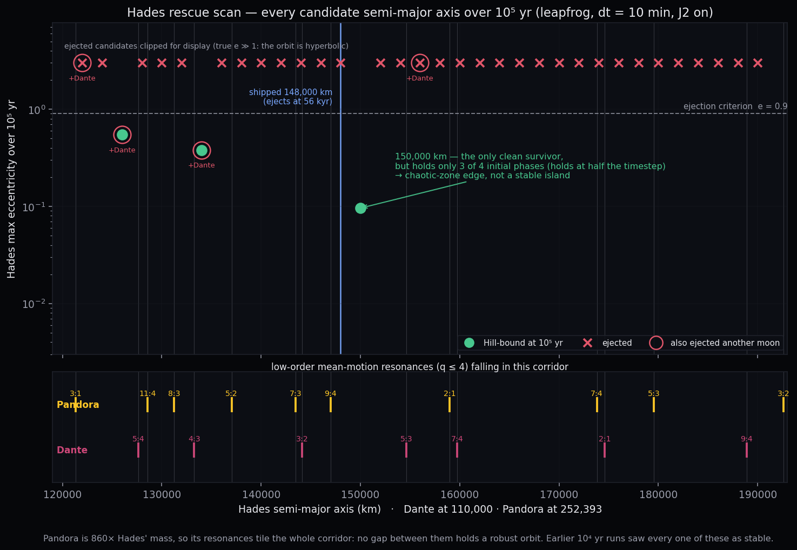

# Hades rescue scan — can a minimal orbit change stop the ejection?

The shipped Hades (a = 148,000 km) is chaotically ejected at ~56 kyr, confirmed at two
step sizes (see `../../context-notes.md`, 2026-08-19). This scan asks whether a
**minimal change to Hades' orbit alone** produces a robustly stable placement, so the
moon can stay in the design rather than being moved wholesale or dropped.

Method: step one Hades element, hold everything else at its shipped value, and integrate
each candidate for **1e5 yr** — about twice the observed ejection time — in the exact
validation-cell configuration (leapfrog, 10-min step, C J2 force, 2,000 uniform
snapshots). Verdict = Hill-bound at the end AND e_max < 0.9. `collateral` flags any OTHER
moon that also ejects, which disqualifies a candidate even when Hades itself survives.

Re-run or extend with `scripts/hades_rescue_scan.py` (`--grid MIN:MAX:STEP`,
`--vary FIELD:v1,v2`, `--combo f=v,f=v`). Completed candidates are skipped, so an
interrupted scan resumes for free.

## Result: semi-major axis alone does not work

35 candidates across 122,000–190,000 km. Three survive, none robustly.

*Every candidate's maximum eccentricity over 10⁵ yr, above the comb of low-order
resonances that explains the verdicts. Ejected candidates are clipped for display —
their true eccentricity runs past 1 (a hyperbolic, unbound orbit). Regenerate both
palettes with `scripts/plot_rescue_scan.py`; the light version is `rescue_scan_light.png`.*

| a (km) | Δa | verdict | e_max | nearest low-order resonances | collateral |
|---|---|---|---|---|---|
| 122,000 | -17.6% | ejected | 9.999 | 5:4 Dante (7.0%) · 3:1 Pandora (0.8%) | Dante |
| 124,000 | -16.2% | ejected | 9.999 | 5:4 Dante (4.4%) · 3:1 Pandora (3.3%) | — |
| 126,000 | -14.9% | **BOUND** | 0.548 | 5:4 Dante (2.0%) · 11:4 Pandora (3.0%) | Dante |
| 128,000 | -13.5% | ejected | 9.999 | 5:4 Dante (0.4%) · 11:4 Pandora (0.7%) | — |
| 130,000 | -12.2% | ejected | 9.999 | 5:4 Dante (2.7%) · 8:3 Pandora (1.4%) | — |
| 132,000 | -10.8% | ejected | 9.999 | 4:3 Dante (1.4%) · 8:3 Pandora (0.9%) | — |
| 134,000 | -9.5% | **BOUND** | 0.381 | 4:3 Dante (0.8%) · 8:3 Pandora (3.2%) | Dante |
| 136,000 | -8.1% | ejected | 9.999 | 4:3 Dante (3.0%) · 5:2 Pandora (1.1%) | — |
| 138,000 | -6.8% | ejected | 9.999 | 4:3 Dante (5.1%) · 5:2 Pandora (1.1%) | — |
| 140,000 | -5.4% | ejected | 9.999 | 3:2 Dante (4.5%) · 5:2 Pandora (3.3%) | — |
| 142,000 | -4.1% | ejected | 9.999 | 3:2 Dante (2.3%) · 7:3 Pandora (1.5%) | — |
| 144,000 | -2.7% | ejected | 9.999 | 3:2 Dante (0.1%) · 7:3 Pandora (0.6%) | — |
| 146,000 | -1.4% | ejected | 9.999 | 3:2 Dante (1.9%) · 9:4 Pandora (1.0%) | — |
| 148,000 | +0.0% | ejected | 9.999 | 3:2 Dante (3.9%) · 9:4 Pandora (1.0%) | — |
| 150,000 | +1.4% | **BOUND** | 0.096 | 5:3 Dante (4.7%) · 9:4 Pandora (3.1%) | — |
| 152,000 | +2.7% | ejected | 9.999 | 5:3 Dante (2.6%) · 9:4 Pandora (5.2%) | — |
| 154,000 | +4.1% | ejected | 9.999 | 5:3 Dante (0.6%) · 2:1 Pandora (4.7%) | — |
| 156,000 | +5.4% | ejected | 9.999 | 5:3 Dante (1.3%) · 2:1 Pandora (2.8%) | Dante |
| 158,000 | +6.8% | ejected | 9.999 | 7:4 Dante (1.7%) · 2:1 Pandora (0.9%) | — |
| 160,000 | +8.1% | ejected | 9.999 | 7:4 Dante (0.2%) · 2:1 Pandora (0.9%) | — |
| 162,000 | +9.5% | ejected | 9.999 | 7:4 Dante (2.1%) · 2:1 Pandora (2.8%) | — |
| 164,000 | +10.8% | ejected | 9.999 | 7:4 Dante (3.9%) · 2:1 Pandora (4.8%) | — |
| 166,000 | +12.2% | ejected | 9.999 | 7:4 Dante (5.6%) · 7:4 Pandora (6.7%) | — |
| 168,000 | +13.5% | ejected | 9.999 | 2:1 Dante (6.0%) · 7:4 Pandora (5.0%) | — |
| 170,000 | +14.9% | ejected | 9.999 | 2:1 Dante (4.1%) · 7:4 Pandora (3.3%) | — |
| 172,000 | +16.2% | ejected | 9.999 | 2:1 Dante (2.3%) · 7:4 Pandora (1.6%) | — |
| 174,000 | +17.6% | ejected | 9.999 | 2:1 Dante (0.5%) · 7:4 Pandora (0.2%) | — |
| 176,000 | +18.9% | ejected | 9.999 | 2:1 Dante (1.2%) · 7:4 Pandora (1.9%) | — |
| 178,000 | +20.3% | ejected | 9.999 | 2:1 Dante (2.8%) · 5:3 Pandora (1.3%) | — |
| 180,000 | +21.6% | ejected | 9.999 | 2:1 Dante (4.5%) · 5:3 Pandora (0.4%) | — |
| 182,000 | +23.0% | ejected | 9.999 | 9:4 Dante (5.7%) · 5:3 Pandora (2.1%) | — |
| 184,000 | +24.3% | ejected | 9.999 | 9:4 Dante (4.0%) · 5:3 Pandora (3.7%) | — |
| 186,000 | +25.7% | ejected | 9.999 | 9:4 Dante (2.3%) · 3:2 Pandora (5.1%) | — |
| 188,000 | +27.0% | ejected | 9.999 | 9:4 Dante (0.7%) · 3:2 Pandora (3.6%) | — |
| 190,000 | +28.4% | ejected | 9.999 | 9:4 Dante (0.9%) · 3:2 Pandora (2.0%) | — |
The two inner survivors (126,000 and 134,000 km) eject **Dante** instead and let Hades'
eccentricity run to 0.55 / 0.38 — trading one ejection for another. That left 150,000 km
(+1.4%, e_max 0.096) as the only clean candidate, so it went through a robustness
battery: half the timestep, and three other initial mean anomalies.

| variant | verdict | e_max |
|---|---|---|
| a=150,000 · dt5 | **BOUND** | 0.145 |
| a=150,000 · ma0 | ejected | 9.999 |
| a=150,000 · ma215 | **BOUND** | 0.131 |
| a=150,000 · ma75 | **BOUND** | 0.137 |
**150,000 km fails.** Surviving three of four phases means the candidate sits on the edge
of the chaotic zone, not inside a stable island — it cannot be shipped as canon.

## Why the whole zone is chaotic

Pandora is the cause. At 4.3e24 kg it is 860x Hades' mass and about a 1/170 mass ratio to
Polyphemus — Earth–Moon territory for a satellite system. Its low-order resonances
(3:1, 11:4, 8:3, 5:2, 9:4, 2:1, 7:4, 5:3) tile the entire Dante-to-Pandora corridor, and
the scan shows that landing within ~1% of any of them is fatal while the gaps between
them are too narrow to hold a robust orbit. The 1e4-yr runs of earlier sessions could not
see this: every one of these candidates looks stable on that horizon.

The 3:2 resonance-lock route is already closed for an independent reason — J2's apsidal
precession detunes the marginal libration and the moon ejects at ~510 yr
(`../../STABILITY_REPORT.md`).

The commands behind the second pass below, for reference:

    .venv/bin/python scripts/hades_rescue_scan.py --jobs 6 \
      --vary i:5,7,9,13 --vary e:0,0.01,0.02 \
      --combo "i=5,e=0.01" --combo "a=150000,i=5,e=0.01"
    # then, per survivor, the robustness battery:
    .venv/bin/python scripts/hades_rescue_scan.py --jobs 4 \
      --combo "e=0.01,i=5,ma=0" --combo "e=0.01,i=5,ma=75" --combo "e=0.01,i=5,ma=215"
    .venv/bin/python scripts/hades_rescue_scan.py --jobs 1 --dt-minutes 5 --combo "e=0.01,i=5"

## What is stored here

Per-candidate `alpha_centauri_summary.json`, its `hypotheticals.json`, and `run.log`.
The 2,000-snapshot `alpha_centauri_timeseries.csv` files are **gitignored for this
directory only** (1.3 MB x 40 = 52 MB of scan intermediate); every verdict in the tables
above comes from the summaries, and a candidate worth plotting can be re-run from its
stored `hypotheticals.json`.

## Second pass: the other orbital elements, and the verdict

The semi-major-axis scan above says nothing survives its own robustness check, so the
second pass varied the elements that leave the orbit's SIZE alone — inclination
(Hades sits ~6° off its Laplace plane: i = 11° against Polyphemus' 5° obliquity) and
eccentricity. Every candidate that survived its first 10⁵ yr run then went through the
same battery: three other initial mean anomalies (0°, 75°, 215° against the shipped
140°) and a half-timestep run.

| candidate | Hades survives | no moon lost | Hades e_rms | Dante e_rms |
|---|---|---|---|---|
| shipped (a 148,000 · e 0.05 · i 11°) | 0/1 | 0/1 | — | — |
| **combo: i 5° + e 0.01** | **5/5** | **4/5** | 0.0333–0.0438 | 0.0170–0.0228 |
| a 150,000 only | 4/5 | 4/5 | 0.0434–0.0598 | 0.0194–0.0378 |
| e 0.01 only | 3/5 | 3/5 | 0.0313–0.0464 | 0.0179–0.0189 |
| i 5° only | 1/5 | 1/5 | 0.0458 | 0.0335 |

Board of record for comparison: Hades e_rms 0.0385 (~15× Io), Dante e_rms 0.0186 (~1200× Io).

**The combo is the recommendation.** It is the only candidate where Hades survives every
realization, it passes the half-timestep resolution test that i-only fails, and its
eccentricities land on the board's existing values — so the tidal-heating rows move by
less than their own run-to-run scatter. In one realization (mean anomaly 0°) Hades
survives but Dante impacts instead, which is why it is 4/5 rather than 5/5.

Two cautions that must travel with these numbers. Single-element routes look better or
worse than they are at n=5 — 3/5 and 4/5 are not distinguishable at this sample size, and
ranking them would need 20–30 realizations per candidate (8–11 h each). And Dante's e_rms
varies by a factor of two across surviving realizations of the same candidate, so no
single run's value may be quoted as the input to a tidal-heating row; use the range.

## What "ejection" actually is: impact, not escape

The verdict flag says "unbound", which is misleading. Tracked to the end, the apoapsis
never exceeds ~0.02 R_Hill (Hades sits at 0.013 R_Hill and the Hill radius is 160 R_p),
and Hades never crosses Pandora's orbit. What happens is that the PERIAPSIS collapses:
in the canonical run it falls 1.45 → 0.78 → 0.60 R_p over 50 yr, i.e. through the rocky
Roche limit (1.31 R_p) and then inside the planet. Hades is tidally shredded and hits
Polyphemus; the sim carries no collision detection, so REBOUND flings the point mass
hyperbolically out of the close encounter, and THAT is the e ≥ 1 our verdict catches.

The physical outcome is therefore a moon lost to the planet — plausibly feeding a ring,
which this system already has (Chaos's plane). Phobos is the solar-system analogue and it
argues both ways: an infalling moon is a real thing, but Phobos has 20–40 Myr left
(2015NatGe...8..913B, 2016JGRE..121.1054H), a hundredth of Mars' age, against Hades' 56 kyr
in a 6 Gyr system — five orders of magnitude short of the standard "observed
configurations should be stable over the system's age" argument.

## Backward integration kills the last narrative escape

REBOUND integrates backward by simply negating the timestep, and both leapfrog and IAS15
are time-symmetric, so `scripts/backward_probe.py` runs the system into the past. What it
cannot do is recover history: the Lyapunov time is ~1.2×10⁴ yr, so 5×10⁴ yr of detail is
unrecoverable in either direction (a 100-yr round trip already loses Hades' orbital phase,
which turns over ~10⁵ times per century, while retracing the orbit's shape). The question
it CAN answer is statistical, and it is the one the design needed.

| initial mean anomaly | forward | backward |
|---|---|---|
| 140° (shipped) | dies at 56,350 yr | dies at 69,100 yr |
| 0° | 8,700 yr | 12,100 yr |
| 75° | 25,600 yr | survives 10⁵ yr |
| 215° | 26,150 yr | 14,150 yr |

Hades dies in 4/4 realizations forward and 3/4 backward. The shipped orbit is an
improbable state in BOTH time directions — it is not reachable from a stable past, so
"a moon recently destabilized (or captured) and now in its endgame" has no support. The
shipped phase is also on the lucky side; the median lifetime across phases is ~26 kyr.

Capture is independently impossible here, which closes that story for good: an incoming
body arrives hyperbolic and needs dissipation to become bound (no disk remains), and it
would have to thread Chaos, Cassandra, and Pandora to reach an inner circular orbit —
the same crossings that would scatter it or wreck the existing moons. Captured moons in
the solar system are uniformly distant, eccentric, and often retrograde; inner regular
satellites form in situ. So the shipped configuration is an artifact of hand placement,
not a physical state, and the honest options are to fix the orbit or to change the
structure (Pandora's mass is the root cause: 860× Hades at a 2.22 period ratio).
