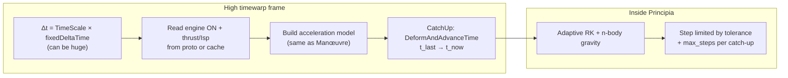

# Principia Time-Warp Thrust — Research Documentation

**Scope:** Reference for building a Persistent-Thrust-like feature yourself. No code changes in this repo from this effort.

**Repo:** `/home/schultz/principia_debug`

---

## 1. Executive summary

| Question | Answer |
|----------|--------|
| Why no thrust during warp? | Warped vessels are `packed` (on-rails). KSP does not run engine physics on them. Principia only copies `part.force` from **unpacked** vessels each frame. Packed vessels are integrated in **catch-up** with **zero** intrinsic force unless something else sets it. |
| Is it mathematically impossible? | **No.** `Manœuvre` + `FlightPlan::BurnSegment` already integrate constant thrust with mass depletion for arbitrary duration. |
| Is it impossible in current code? | **Effectively yes for live play** without new glue: no code path injects thrust for packed vessels. |
| Interstellar today? | **Plan/predict:** yes (flight planner). **Play through years of burn at warp:** no. |
| Your target (10–100 yr burn @ high warp)? | **Not in stock Principia.** Achievable in a fork if thrust uses **analytical / pile-up-level** integration during catch-up, not per-part KSP physics every frame. |

---

## 1b. Target use case (your requirements)

- **Burn duration:** 10–100 years, high Isp, low thrust (e.g. nuclear electric).
- **Timewarp:** High physics warp; vessel **packed** / on-rails.
- **KSP behavior:** Unity unloads the vessel (`vessel.loaded == false`); visually a single mesh, not live `Part` + `Rigidbody` per frame.
- **Constraint:** Must **not** integrate as if every warp frame were thousands of tiny KSP engine physics steps — that would spike CPU, hit `max_steps` / `DeadlineExceeded`, and grow trajectories without downsampling.

**Design principle:** Treat warp burns like **flight-plan burns** (continuous acceleration model), applied during **one catch-up integration** per warp step from `t_last` → `t_now`, with adaptive step size driven by **curvature and tolerance**, not by `TimeScale × fixedDeltaTime` as a step count multiplier.

---

## 1c. Packed vessels in Principia (not "no parts")

Principia still keeps **C++ `Part` objects** for a packed vessel, but they are **unloaded** in the plugin sense:

| State | Unity | Principia C++ |
|-------|--------|----------------|
| Unpacked | `vessel.loaded`, live `Part`/`rb`, `InsertOrKeepLoadedPart` | Per-part DOF, forces from `part.force`, `mass_change` for solids |
| Packed (on-rails) | Orbit-driven mesh; `FashionablyLate` skips vessel | Parts from `protoVessel.protoPartSnapshots` via `InsertUnloadedPart` — all parts get **same** `vessel.orbit` pos/vel at insert ([ksp_plugin_adapter.cs](ksp_plugin_adapter/ksp_plugin_adapter.cs) ~1397–1420) |
| Display update | `UpdateVessel` sets stock `vessel.orbit` from Principia | Per-part `rb` sync only if `vessel.loaded` (~526–564) |

So you do **not** need live Unity parts to apply thrust. You need **intrinsic acceleration on the pile-up** (or on C++ parts without `is_loaded`) during `CatchUpLaggingVessels` / `DeformAndAdvanceTime`.

Engine **state** while packed: query `ProtoPartSnapshot` / `protoPartModuleSnapshots` in C# (or cache thrust/Isp at pack time). Do **not** depend on `ModuleEngines` on a live `Part` each frame.

---

## 1d. Should you clone Persistent Thrust?

**Optional but useful** — not required to start. Clone into a **sibling directory** (not inside `principia_debug`) so you can diff without polluting the Principia tree.

**What to grep in Persistent Thrust:**

- `packed`, `onRails`, `VesselSwitch`, `TimeWarp`, `maximum_dt`
- Where thrust is applied when `vessel.packed` or orbit is on-rails
- Whether it uses **analytical** Δv per frame vs force integration
- Interaction with other physics mods

**How Principia differs (expect different hooks):**

- PT typically patches **stock/on-rails** propagation; Principia **replaces** vessel propagation with n-body + catch-up.
- Your hook is almost certainly **before** `PileUp::DeformAndAdvanceTime` in Principia, using **`Manœuvre`-style acceleration**, not KSP `FlightIntegrator`.
- PT does not solve n-body gravity, SOI, or collapsibility — you still inherit Principia's costs when thrust ≠ 0.

If you clone it, a short "PT vs Principia hook map" note in your fork README is enough; no need to merge repos.

---

## 1e. Performance: not setting the computer on fire

### What makes integration expensive

1. **Nonzero intrinsic force** → adaptive `FlowWithAdaptiveStep` instead of cheap fixed-step coast ([pile_up.cpp](ksp_plugin/pile_up.cpp) ~575–618).
2. **Non-collapsible vessel** while any part has `intrinsic_force` ([vessel.cpp](ksp_plugin/vessel.cpp) ~1332–1335) → psychohistory grows; downsampling disabled on collision (`DisableDownsampling`).
3. **Large catch-up Δt** per warp frame (days–years) → many **internal** RK steps unless tolerances allow large steps (low thrust helps).
4. **`max_steps` / deadline** → `DeadlineExceededError` if integration cannot reach `current_time_` in one catch-up ([ephemeris_body.hpp](physics/ephemeris_body.hpp) ~1693).
5. **Flight planner UI** uses `max_ephemeris_steps_per_frame = 1000` per recompute slice — separate from live catch-up but relevant for planning 100-year burns.

### What keeps it tractable for 10–100 year burns

| Do | Avoid |
|----|--------|
| Use **constant-thrust + mass flow** model (`Manœuvre::ComputeIntrinsicAcceleration`) | Re-sampling `part.force` each visual frame across centuries |
| Apply **one aggregate acceleration** at pile-up (or root part) | Per-engine Unity physics while packed |
| Let adaptive integrator choose step size from **tolerance** (low thrust → often larger steps in smooth regions) | Fixed step = warp Δt |
| **Cache** thrust/Isp/direction at burn start; update direction on a coarse schedule (e.g. inertial fixed, or Frenet refresh every N days) | Frenet frame every internal substep unless needed |
| **Chunk** extremely long catch-up: integrate to `min(t_now, t_last + chunk)` with cap on steps per frame | Single catch-up of 50 years in one frame with unlimited steps |
| Use flight planner to **validate** burn before flying | Discovering singularities only in live warp |
| Coast segments: collapsible + fixed step | Leaving engines "on" in model during coast |

### Memory over 100 years

Even with efficient integration, **storing** dense psychohistory for 100 years of thrust may dominate RAM. Mitigations to research in code:

- `DiscreteTrajectory` downsampling parameters ([integrators.cpp](ksp_plugin/integrators.cpp) `DefaultDownsamplingParameters`) — only when collapsible.
- Segment boundaries / checkpoints when burn starts and ends (`EnactCollapsibilityChange`).
- Optional "thin history" mode: keep full ephemeris for solver, sparse points for display (would be new work).

### Recommended architecture for your fork

**Not recommended:** forcing vessel to stay unpacked at high warp to get `part.force` — fights KSP, destroys warp benefit, still wrong for unloaded distant vessels.

**Strong alternative for 100-year burns:** "Execute plan segment" button — one C++ call integrates entire burn interval (flight-plan path), then only **display** catch-up during warp. Less "hands on throttle", safest for CPU.

---

## 2. Two thrust pipelines (do not conflate them)

### Pipeline A — Live gameplay (warp gap is here)

1. KSP `FlightIntegrator` computes `part.force` / `part.forces` (engines, RCS, some drag).
2. `FashionablyLate` snapshots forces — **only** `is_manageable(v) && !v.packed`.
3. `WaitForFixedUpdate` calls `PartApplyIntrinsicForce` — **only** when `!vessel.packed` and vessel is **loaded**.
4. `FreeVesselsAndPartsAndCollectPileUps` → `PileUp::RecomputeFromParts` sums `part.intrinsic_force()`.
5. `CatchUpLaggingVessels` / `FutureCatchUpVessel` → `PileUp::DeformAndAdvanceTime` → `AdvanceTime`.
6. If `intrinsic_force_ == 0`: fixed-step coast; else adaptive step with `a = F/m`.

### Pipeline B — Flight planner (long burns already work)

1. `BurnEditor` reads `ModuleEngines` / `ModuleRCS` once (thrust, Isp, ignited engines).
2. User burn → C++ `NavigationManœuvre` (`Manœuvre` in [manœuvre_body.hpp](ksp_plugin/manœuvre_body.hpp)).
3. `FlightPlan::BurnSegment` → `ephemeris_->FlowWithAdaptiveStep` with `ComputeIntrinsicAcceleration` (Tsiolkovsky mass flow).
4. Used for prediction/UI — **not** applied to packed vessel state during warp.
5. `RenderGuidance` sets stock maneuver node for SAS — guidance only, not continuous thrust.

---

## 3. Per-frame timeline (active vessel)

Unity / adapter order (simplified):

| Stage | File | What matters for thrust |
|-------|------|-------------------------|
| `FixedUpdate` | [ksp_plugin_adapter.cs](ksp_plugin_adapter/ksp_plugin_adapter.cs) ~1211 | Starts `WaitedForFixedUpdate` coroutine |
| `Early` / precalc | same | `AdvanceTime(universal_time)` if time advancing |
| Packed vessels | same ~1704 | `FutureCatchUpVessel` queued (async catch-up) |
| Stock physics | KSP | Engines fire only if unpacked |
| `FashionablyLate` | same ~1766 | Collect `part.force` if `!packed` |
| `WaitForFixedUpdate` | same ~1283 | `Δt = TimeScale * fixedDeltaTime` |
| Loaded parts | same ~1328 | `InsertOrKeepLoadedPart`, `PartApplyIntrinsicForce` |
| Collect pile-ups | same ~1533 | `FreeVesselsAndPartsAndCollectPileUps` |
| Integrate | same ~1559 | `CatchUpLaggingVessels` (all pile-ups) |
| `AdvanceTime` (next frame Early) | [plugin.cpp](ksp_plugin/plugin.cpp) ~754 | Clears forces on **loaded_vessels_** only |

**Packed catch-up:** [plugin.cpp](ksp_plugin/plugin.cpp) `CatchUpVessel` → `pile_up->DeformAndAdvanceTime(current_time_)` with forces from parts — typically **zero** during warp because step 2–3 did not run.

---

## 4. Key source locations (index)

### Adapter (C#)

| Topic | Path | Lines (approx) |
|-------|------|----------------|
| Force dicts / TODO move to C++ | [ksp_plugin_adapter.cs](ksp_plugin_adapter/ksp_plugin_adapter.cs) | 206–213 |
| `time_is_advancing_` skip | same | 568–580, 1291–1293 |
| Unpacked force apply | same | 1328–1393 |
| Catch-up queue (packed) | same | 1704–1709 |
| FashionablyLate `!packed` gate | same | 1783–1831 |
| Stock gravity kill when active packed | same | 1771–1778 |
| Guidance only (no warp thrust) | same | 1995–2072 |
| Engine stats for plans | [burn_editor.cs](ksp_plugin_adapter/burn_editor.cs) | 362–386 |
| Warp to maneuver UI | [flight_planner.cs](ksp_plugin_adapter/flight_planner.cs) | 612–613 |

### Plugin (C++)

| Topic | Path |
|-------|------|
| `ApplyPartIntrinsicForce` requires loaded | [plugin.cpp](ksp_plugin/plugin.cpp) ~491–497 |
| `AdvanceTime` clear forces | [plugin.cpp](ksp_plugin/plugin.cpp) ~754–766 |
| `CatchUpLaggingVessels` / `CatchUpVessel` | [plugin.cpp](ksp_plugin/plugin.cpp) ~769–825 |
| `RecomputeFromParts` / `AdvanceTime` thrust branch | [pile_up.cpp](ksp_plugin/pile_up.cpp) ~122–158, 572–618 |
| `IsCollapsible` vs intrinsic force | [vessel.cpp](ksp_plugin/vessel.cpp) ~1326–1351 |
| `mass_change` only via loaded insert | [part.hpp](ksp_plugin/part.hpp) ~199–201 |
| Burn integration | [flight_plan.cpp](ksp_plugin/flight_plan.cpp) `BurnSegment` ~469+ |
| Manœuvre acceleration | [manœuvre_body.hpp](ksp_plugin/manœuvre_body.hpp) ~268–277 |
| Planner step budget | [flight_plan.hpp](ksp_plugin/flight_plan.hpp) `max_ephemeris_steps_per_frame = 1000` |

### Journal / API

| Topic | Path |
|-------|------|
| `PartApplyIntrinsicForce` | [serialization/journal.proto](serialization/journal.proto), [interface.cpp](ksp_plugin/interface.cpp) |
| `FutureCatchUpVessel` | [interface_future.cpp](ksp_plugin/interface_future.cpp) |
| `Burn` struct | [interface.hpp](ksp_plugin/interface.hpp), [interface_flight_plan.cpp](ksp_plugin/interface_flight_plan.cpp) |

---

## 5. Why "impossible" is overstated but defensible

**Overstated:** Principia's ephemeris already integrates long thrust burns with mass change for flight plans.

**Defensible for shipping mod:**

- Architectural choice: live thrust = **sample KSP forces**, not model engines.
- KSP warp = packed = no `part.force` from engines.
- `CHECK(is_loaded(vessel))` on force application.
- Extra cost: adaptive integration, non-collapsible trajectories, solid booster `mass_change` only on loaded path, collision checks on large catch-up steps.

Persistent Thrust (external mod) applies thrust during **on-rails** propagation; Principia has **no equivalent hook** before packed catch-up.

---

## 6. Implementation options (for your own fork)

### Option A — Manœuvre during catch-up (closest to existing math)

**Idea:** If `CurrentTime()` ∈ `[manœuvre.initial_time, manœuvre.final_time]` for vessel's flight plan, set intrinsic acceleration on pile-up (or parts) before `RecomputeFromParts`, even when packed.

**Reuse:** `NavigationManœuvre::ComputeIntrinsicAcceleration`, Frenet vs inertial paths in `BurnSegment`.

**Watch:** Engine on/off vs plan; throttle; `CantRebase` during manoeuvre; mass depletion without `InsertOrKeepLoadedPart`.

### Option B — Engine model during catch-up (Persistent Thrust analogue)

**Idea:** Read `ModuleEngines.EngineIgnited`, thrust limiter, etc. on packed active vessel; compute world thrust vector; relax `is_loaded` check or add `VesselApplyIntrinsicAcceleration`.

**Watch:** Atmosphere, RCS, off-center forces, [ksp_plugin_adapter.cs](ksp_plugin_adapter/ksp_plugin_adapter.cs) ~1591 "loaded packed" comment.

### Option C — Batch fast-forward

**Idea:** UI button: integrate burn interval in C++ in one call, update psychohistory, sync KSP when unpacked.

**Watch:** Save format, user expectation vs continuous warp.

### Option D — Workaround only

1× only when burning; planner for design. Not sufficient for interstellar play-through.

---

## 7. Planner / interstellar notes

- Long coasts and burns: prolong ephemeris before recomputing segments ([flight_plan.cpp](ksp_plugin/flight_plan.cpp) ~411–416).
- UI may show anomalous segments until enough steps (`max_ephemeris_steps_per_frame`).
- Singularities near bodies: `VanishingStepSize` / `singular` status — test in [flight_plan_test.cpp](ksp_plugin_test/flight_plan_test.cpp).
- Vessel history fixed step: [astronomy/sol_numerics_blueprint.cfg](astronomy/sol_numerics_blueprint.cfg) (`integration_step_size = 10 s` for psychohistory) — separate from burn adaptive integrator (`DefaultBurnParameters` in [integrators.cpp](ksp_plugin/integrators.cpp)).

---

## 8. Self-directed verification checklist

1. Burn at 1× with Principia: trajectory changes; log or debugger shows nonzero `intrinsic_force_` on pile-up.
2. Warp until active vessel `packed`: thrust stops; planner preview still shows burn arc.
3. Long low-thrust plan to distant SOI: confirm segments compute after waiting for ephemeris.
4. Read Persistent Thrust source: search `packed`, `onRails`, `OrbitDriver`, `TimeWarp`.
5. Search Principia issues/wiki for "warp", "thrust", "persistent", "on rails".

---

## 9. External references

- [Principia Concepts — flight planning](https://github.com/mockingbirdnest/Principia/wiki/Concepts#flight-planning)
- [Principia FAQ / known limitations](https://github.com/mockingbirdnest/Principia/wiki/Installing,-reporting-bugs,-and-frequently-asked-questions)
- Persistent Thrust mod (not in this repo): compare on-rails thrust application

---

## 10. Bottom line

**Model interstellar trajectories today** with the flight planner. **Fly them under warp with continuous thrust** requires new code that injects intrinsic acceleration during **packed vessel catch-up** (or batch integration), because the live pipeline intentionally depends on KSP's unpacked physics step. The integrator is not the blocker; the **adapter–KSP packed/unpacked contract** is.

---

## 11. Flight planner: interstellar Δv and burn duration (Q1)

### Does the planner support interstellar travel?

**For trajectory design: yes** — n-body integration with constant-thrust, mass-depleting burns over long plan lengths.

**It does not auto-compute "required Δv"** for an interstellar mission. You supply **Δv** (Frenet components); Principia computes **duration** and integrates. **FlightPlanOptimizer** refines burns toward metrics (celestial centre, distance, inclination, Δv); it does not replace mission analysis.

### Are Δv and duration correct for very high Isp, very low thrust?

**Yes, for Principia's model** ([manœuvre_body.hpp](ksp_plugin/manœuvre_body.hpp)):

- Given **Δv** + thrust + Isp + mass → duration = `m·Isp·(1 − exp(−|Δv|/Isp))/F`
- Given **duration** + direction → Δv = `direction·Isp·ln(m₀/m_f)`
- Integration uses `a = F/m(t)`, `ṁ = F/Isp`

Assumptions: constant thrust, vacuum Isp, no throttle ramp. Use **inertially fixed** prograde for multi-year burns when possible.

**Practical limits:** `max_ephemeris_steps_per_frame` (UI anomalous segments), `DeadlineExceeded`, singularities near bodies, engines must be **ignited** when opening burn editor (else `UseTheForceLuke` fake engines — wrong for interstellar).

### Planner workflow for 10–100 year burns

1. Ignite low-thrust engines → open burn editor (captures thrust/Isp).
2. Enter Δv from your mission design → check displayed duration vs hand calculation.
3. Extend flight plan end time; wait for segment integration / ephemeris prolongation.
4. Validate on plot; watch for anomalous segments.

---

## 12. "Cheating" with the flight planner (Q2)

**No stock cheat** makes the live vessel follow a planner burn during high warp. Planner and live physics are **decoupled** (`RenderGuidance` = navball node only).

| Approach | Result |
|----------|--------|
| Plan-only + warp | Preview correct; ship **coasts** during warp |
| Warp to maneuver | Jumps to burn **start** only |
| 1× for whole burn | Works; not viable for 100 years |
| **Fork: plan-driven catch-up** | Apply same `Manœuvre` during `CatchUpLaggingVessels` while `t` in burn window — **best cheat** |

**Do not** run stock Persistent Thrust + Principia on the same vessel (stock `Orbit.Perturb` vs n-body).

---

## 13. Persistent Thrust reference (`Persisten_THRUST_debug/`)

Directory name is **`Persisten_THRUST_debug`** (typo: missing "t").

| Path | Role |
|------|------|
| [VesselData.cs](Persisten_THRUST_debug/src/PersistentThrust/BackgroundProcessing/VesselData.cs) ~153–165 | Unloaded: aggregate Δv, **`Orbit.Perturb`** (stock) — incompatible with Principia propagation |
| [PersistentScenarioModule.cs](Persisten_THRUST_debug/src/PersistentThrust/BackgroundProcessing/PersistentScenarioModule.cs) | **One unloaded vessel per physics tick** — CPU throttle pattern to copy |
| [PersistentProcessingVesselModule.cs](Persisten_THRUST_debug/src/PersistentThrust/BackgroundProcessing/PersistentProcessingVesselModule.cs) | Loaded: `PersistHeading`; unloaded: cache maneuver/orbit strings |
| [EngineBackgroundProcessing.cs](Persisten_THRUST_debug/src/PersistentThrust/BackgroundProcessing/EngineBackgroundProcessing.cs) | Proto-part thrust, Isp, fuel on **unloaded** craft |

Use PT for **proto engine state** and **scheduling ideas**; implement thrust via Principia **Manœuvre + catch-up**, not `orbit.Perturb`.
